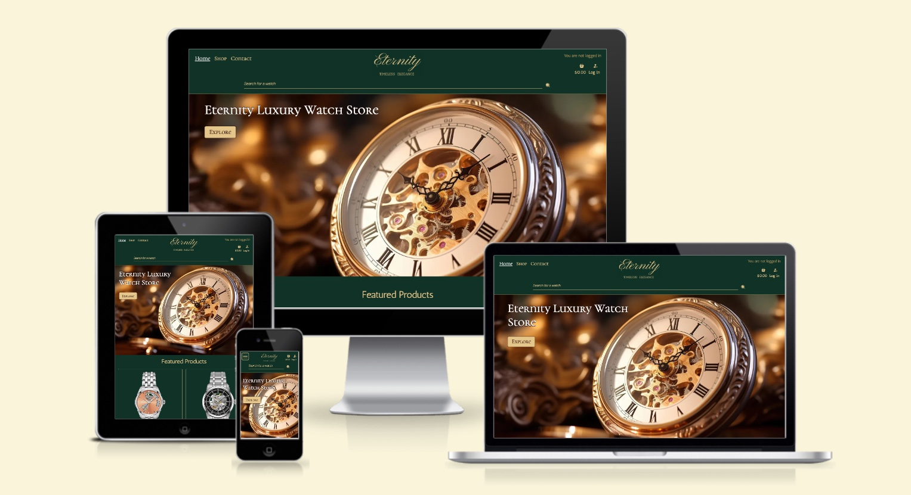

# Eternity - Luxury Watch Store



### Project Link

The live store is located at the following [address](https://eternity-watch-store-1f855f4289ad.herokuapp.com/).


## Agile Methodology

This project was executed using the Agile framework, promoting iterative progress and adaptability. The Agile approach was employed to plan and monitor the project's advancements. Agile principles were consistently applied through various tools and techniques:

**Planning and Monitoring:**

All user stories were systematically managed via GitHub Issues and Projects, ensuring an organised and methodical workflow.

**Custom Templates:**

Each user story was documented using custom templates, which included sections such as the user story, acceptance criteria, and tasks. This standardisation facilitated easier management and tracking of progress for each story.

**MoSCoW Prioritisation:**

To prioritise tasks, the MoSCoW method (Must have, Should have, Could have, and Won’t have) was utilised with labels. This prioritisation method helped categorise the importance of each user story, ensuring that essential features were developed first within an iteration, while less critical features were scheduled for later development if necessary. The implementation can be reviewed [here](https://github.com/KatePaulauskas/watch-store/issues).

**Kanban Board Management:** 

A Kanban board within GitHub Projects was used to manage user stories, divided into three columns: Todo, In Progress, and Done. This provided clear visibility into the project's status at any given time. The board can be viewed [here](https://github.com/users/KatePaulauskas/projects/4).

**Milestones and Iterative Progress:**

Milestones were established to define the project's iterations and were linked to the project epics. Each user story was allocated to one of six iterations, ensuring a structured development process and smooth progress tracking. The project milestones can be seen [here](https://github.com/KatePaulauskas/watch-store/milestones).

By leveraging these Agile practices and tools, the project maintained a clear and organised structure, allowing for effective tracking and timely completion of all 41 user stories.

## User Experience Design

The Eternity - Luxury Watch Store website was meticulously developed to cater to the needs of discerning customers seeking affordable luxury watches. By implementing a strategic approach that combines user-centric design and business objectives, the platform ensures an exceptional online shopping experience for luxury watch enthusiasts.

### Strategy

The foundation of the user experience was built by considering user needs and business objectives. The strategy focused on three main areas: identifying the target audience, defining clear business goals, and delivering value.

#### User Needs

Understanding the diverse needs of our users was essential. After thorough research, the **target audience** for the Eternity website was identified as follows:

* **Watch Collectors:** Individuals seeking affordable yet luxurious timepieces to enhance their collections.
* **Affordable Luxury Shoppers:** Customers looking for premium-quality watches that provide a sense of luxury without a high-end price tag.
* **Fashion Enthusiasts:** Individuals who view watches as key elements of their style and wardrobe.
* **Professionals:** Business people and executives who desire sophisticated and elegant timepieces that fit within their budget.
* **Watch Aficionados:** Enthusiasts who appreciate the craftsmanship and style of luxury watches at more accessible prices.
* **Gift Buyers:** Individuals searching for high-quality watches as special occasion gifts that offer great value.
* **International Clients:** Customers from around the globe seeking exclusive yet affordable watch brands and models.
* **Partners:** Jewelers and boutiques interested in potential partnerships and collaborations.

These users require a platform that offers comprehensive, reliable, high-quality information about affordable luxury watches, including product details, reviews, and a seamless purchasing experience.

#### Business Objectives

For Eternity, the primary business objectives include streamlining the purchase process, showcasing a curated selection of high-quality yet affordable watches, and establishing a strong online presence to attract and retain discerning customers. The brand’s commitment is to offer luxury watches that are both timeless and accessible, within a price range customers are comfortable and confident purchasing online.

**Goal**

The primary goal of the Eternity website is to streamline the watch purchasing process for customers while providing an inviting, informative, and efficient online presence that highlights the high-quality, affordable timepieces offered.

#### Focus, Definition, and Value

**Focus**

Eternity aims to simplify the watch purchasing process for customers. The key objectives include creating an inviting, informative, and efficient online presence that showcases the high-quality, affordable watches available at the store.

**Definition**

The website is designed to be a comprehensive online platform for Eternity that serves as an informative and user-friendly website for watch enthusiasts. Key features include:

- Detailed information about the store and its range of affordable luxury watches.
- An online purchasing system for browsing, selecting, and buying watches.
- Contact details and a form for inquiries.
- A visually appealing and easy-to-navigate interface.

**Value**

The value of the Eternity website is multi-faceted:

**For the Business:** The website will enhance the store’s online presence, streamline the purchase process, build a network of satisfied customers, and bolster the store's reputation for offering high-quality yet affordable products.

**For the Users:** Customers will gain confidence in the store's offerings through detailed product descriptions and reviews. They will enjoy the convenience of browsing and purchasing luxury watches online with options for extended warranties, ensuring a satisfying and trustworthy shopping experience.

By focusing on these key areas, the Eternity website aims to deliver a superior user experience that aligns with both business objectives and user needs.

### Scope

At the Scope Plane, features and content were developed by defining User Scenarios to understand how different users will interact with the site. This process involved creating Epics and User Stories to break down these scenarios into manageable tasks and features.

#### User Scenarios

**First Time Visitor:**

A new visitor can effortlessly navigate the website with a clear introduction and an intuitive menu. They can learn about the store's mission, browse the range of watches, and view a gallery of featured timepieces. They can also create an account and make their first purchase with ease.

**Returning Customer:**

Returning customers can quickly log in to their accounts to view and manage their orders, check their purchase history, and explore new arrivals or special offers.

**Potential Partners:**

Jewelers, boutiques, and other potential partners can find comprehensive information about the store's offerings and expertise. They can view the quality of the watches through the gallery and contact the store for potential collaborations using the dedicated contact form.

#### - User Stories -

##### **Epic 1: Home Page Experience**

 As a **user** I can **see an engaging and informative home page** so that **I can easily navigate the store and discover featured products**.

- **User Story: Home Page First Impression (above fold)**

     As a **user** I can **see a visually appealing homepage with store name, logo, tagline, high-quality image and call to action button** so that **I get a good first impression of the store**.

- **User Story: Navigation Menu**

     As a **user**, I can **access the navigation menu from any page** so that **I can easily access site pages and find what I’m looking for or discover what is available.**

- **User Story: Search Bar**

     As a **user**, I can **access the search functionality in the header of the site** so that **I can easily find what I’m looking for or discover what is available**.

- **User Story: Featured Products**

     As a **user**, I can view **featured products on the home page** so that **I can quickly see what products are popular.**

- **User Story: Brand Connection**

     As a **user**, I can **read about the store, its goal, and mission on the home page** so that **I can connect with the values and vision of the business**.


- **User Story: Social Media Engagement**

     As a **user**, I can see **links to social media profiles in the footer of the site** so that **I can follow the brand and stay connected via social media platforms**.

- **User Story: Footer Menu and Contact Information**

     As a **user**, I can **easily access contact details and important links in the footer of the site** so that **I can get in touch with the store if needed and quickly navigate to key sections like Home, Shop, Terms & Conditions, Return Policy, Privacy Policy, and Get in Touch**.

- **User Story: Newsletter Subscription**

     As a **visitor**, I can **sign up for a newsletter subscription** so that **I can receive regular updates, promotions, and news from the store**.

- **User Story: Submit Contact Form Request**

##### **Epic 2:  User Registration and Account Management**

 As a **shopper** I **can register and manage my account** so that **I can have a personalised shopping experience**.

- **User Story: Account Creation**

     As a **new customer**, I can **create a new account through the Log In bar** so that **I can view my profile and past purchases**.

- **User Story: Account Creation Email Confirmation**

     As a **new customer**, I can **receive an email confirmation after registering an account** so that **I know my account setup was successful**.

- **User Story: Login Access**

     As an **existing customer**, I can **log in to my account** so that **I can access my account and purchase history**.

- **User Story: Password Reset**

     As an **existing customer**, I can **reset my password if I forget it** so that **I can regain access to my account**.

- **User Story: Update Personal Details**

     As an **existing customer** I can **update my default delivery details** so that **my account information stays accurate and up to date**.
     
- **User Story: View Order History**

     As a **shopper**, I can **view my order history** so that **I can reference previous purchases**.

##### **Epic 3: Product Browsing and Search**

 As a **user**, I can **browse and search for watches** so that **I can find products that meet my preferences**.

- **User Story: Shop Page**

     As a **user**, I can **access the shop page (all-products page) from the site menu** so that **I can view all available watches**.

- **User Story: Category Browsing**

     As a **user**, I can **browse watches by categories such as brand, gender, and price** so that **I can find what I’m looking for easily**.

- **User Story: Product Sorting**

     As a **user** I can **sort store products** so that **I can find the best-priced, and most popular product or sort the products by name**.

- **User Story: Keyword Search**

     As a **user**, I can **use the search bar to find specific watches by keyword or model number** so that **I can quickly locate desired products**.

- **User Story: Multiple Filters Application**

     As a **user** I can **apply multiple filters (e.g., brand and gender) on the shop page** so that **I can narrow down the selection**.

- **User Story: Search Query and Result Count Display**

     As a **user**, I can **clearly see my search query and the total number of results** so that **I can assess if the desired product is offered by the store**.

##### **Epic 4: Product Details**

 As a **shopper**, I can **view detailed information about watches** so that **I can make informed purchasing decisions**.

- **User Story: Product Page**

     As a **shopper**, I can **see detailed product descriptions, specifications, and images** so that **I can understand the product features**.

- **User Story: Select Product Quantity**

     As a **shopper**, I can **select product quantity** so that I can **customize my choice before adding it to the cart**.

##### **Epic 5: Shopping Cart and Checkout**

 As a **shopper**, I can **manage my shopping cart and complete purchases** so that **I can buy watches conveniently**.

- **User Story: Add Items to Cart**

     As a **shopper**, I can **add items to my shopping cart** so that **I can purchase them later**.

- **User Story: Review Cart**

     As a **shopper**, I can **view the contents of my shopping cart and the total amount** so that **I can review my selections and total cost before proceeding to checkout**.

- **User Story: Update Cart**

     As a **shopper**, I can **remove or update quantities of items in my cart** so that I can **adjust my order**.

- **User Story: Add Customer Details at Checkout**

     As a **shopper**, I can **enter my customer details during checkout** so that I can **complete my purchase**.

- **User Story: Enter Shipping Address at Checkout**

     As a **shopper**, I can **enter my shipping address** so that **my order can be delivered to me**.

- **User Story: Offer Login at Checkout**

     As a **shopper**, I can **be prompted to log in at checkout** so that I can **prefill my details if I have an account**.

- **User Story: Prefill Customer and Shipping Details**

     As a **shopper**, I can **have my customer and shipping details prefilled if I'm logged in** so that **I can save time during the checkout process**.

- **User Story: Choose the Shipping Method at Checkout**

     As a **shopper**, I can **choose a shipping method** so that I can **select how my order will be delivered to me**.

- **User Story: Add-Ons at Checkout**

     As a **shopper** on the checkout page I can **opt for add-ons such as extended warranty or shipping insurance** so that **I have additional protection for my purchase and secure delivery**.

- **User Story: Add Payment Information at Checkout**

     As a **shopper**, I can easily **enter my payment information** so that I can **check out quickly and with no hassles**.

- **User Story: Payment Security**

     As a **shopper**, I can **feel my personal and payment information is safe and secure** so that I can **provide the required information in confidence to complete my purchase**.

- **User Story: Order Confirmation Page**

     As a **shopper**, I can **view an order confirmation page after checkout** so that I can **verify that my order was accepted and I haven't made any mistakes**.

- **User Story: Order Email Confirmation**

     As a **shopper**, I can **receive an order confirmation via email** so that **I have proof of my purchase**.
     

##### **Epic 6: Admin and Store Management**
 
 As an **admin** I can **manage the products in the store** so that **I can keep the inventory up-to-date and relevant**.

- **User Story: Add a Product as Admin**

     As **an admin**, I can **add a product** so that **I can include new items in the store inventory**.

- **User Story: Edit/Update a Product as Admin**

     As an **admin**, I can **edit or update a product** so that **I can change product prices, descriptions, images, and other product criteria**.
     

- **User Story: Delete a Product as Admin**

     As an **admin**, I can **delete a product** so that **I can remove items that are no longer available**.

- **User Story: Store Policies Management**

     As an **admin** I can **update the content for Terms & Conditions, Return Policy, and Privacy Policy through both the admin panel and the front end** so that **the footer menu always provides accurate and up-to-date information for users.**

- **User Story: Store Contact Form Requests**

    As an **admin** I can **store contact form requests in the database** so that **I can review them, and mark them as read or delete them**.

- **User Story: Track Contact Form Submissions**

    As an **admin** I can **mark contact form submission as "read"** so that **I can track how many I still need to process**.


### Structure

At the Structure Plane, the information organisation and interaction design were developed by defining the site pages, database structure, and purchasing flow. 

#### - Site Pages -

The Eternity Luxury Watch Store comprises of several key pages, each designed to provide essential information and facilitate positive and engaging user experience:

**Home Page:**

* Welcomes visitors with a visually appealing hero image, featured products, and About Us information as well as quick access to key sections like Shop and Contact Us. It sets the tone for the brand and provides an overview of what Eternity offers.

**Shop Page:**

* Displays the full range of luxury watches, allowing users to browse, filter, and sort products by various criteria such as brand, price, and rating. It serves as the main shopping hub for customers.

**Product Page:**

* Offers a detailed view of each watch, including descriptions, specifications, images, price, and customer ratings. It also includes options for selecting quantity and adding the product to the cart.

**Cart Page**

* Provides an overview of selected items, allowing users to review, update quantities, remove products, and view the total cost before proceeding to checkout.

**Checkout Page**

* The final step in the purchasing process, where customers enter shipping and payment details, review their order, and complete their purchase securely.  Logged-in users get their shipping details prefilled if address exists. Users are also presented with additional add-ons: extended warranties and shipping insurance, and they can choose the shipping method.

**Thank You Page**

* Displays a confirmation of the successful purchase, including an order details summary.

**Policies Page**

* This page contains essential store policies such as terms and conditions, return policy, and privacy policy, ensuring transparency and customer trust.

**Contact Page:**

* Contains a contact form for inquiries, collaborations, and feedback, offering users a direct channel to communicate with the store.

**Log In and Sign Up Pages:**

* Enables users to create an account or log in to access a personalised experience and allows superuser to manage store products and policies.

**Orders and Address**

* Allows users to manage their default delivery address and view their order history.

**Log Out**

* A confirmation page allowing users to log out of their account and return to the home page or browse anonymously.

Admin pages: 

**Add Product**

* Enables superuser to add new products, including details like name, price, description, and images, to ensure the product catalog stays up-to-date.

**Manage Products**

* Provides functionality for superuser to delete products from the store or edit them via a hidden page, ensuring easy updates and management of the available products.

**Manage Policies**

* Is the regular Policies Page with additional functionality for superuser, ehich allows superuser to update existing policies via hidden Edit Policy Page, ensuring compliance with business and legal standards.

#### - Database Structure -

The Database Structure below visualises the relationships between the key models of the project. The database schema is designed to effectively manage purchasing process.


**Core Models**

* **Product:**
     Represents the items available for purchase in the store, including details such as name, SKU, price, description, and availability status. Each product belongs to multiple categories and may have add-ons associated with it.

* **Category:**
     Defines the different groups or types of products (e.g., gender and brands).

* **ProductCategory:** 
     A junction table connecting Product and Category. The many-to-many relationship between products and categories allows products to belong to multiple categories.

* **AddOn:**
     Represents optional add-ons that can be purchased alongside a product, such as shipping insurance and extended warranty. Add-ons have an associated price and are linked to each product in an order.

* **Order:**
     Tracks each individual purchase made by a user. It stores details about the user, delivery information, associated add-ons, and payment details. The order model also keeps track of costs such as delivery and grand totals.

* **OrderLineItem:**
     Represents a specific product within an order. Each order can have multiple line items, tracking the quantity and total price of each product purchased.

* **AddOnOrder:**
     A junction table connecting AddOn and Order in a many-to-many relationship, allowing the system to track the quantity of each add-on purchased with an order.

* **DeliveryMethod:**
     Defines the delivery options available for an order, including the name of the method and its associated rate.

**User Management Models**

* **User:**
     Represents the customer who interacts with the store. This model stores user details such as first and last names, email, and whether the user has superuser privileges. It is a default Django model.

* **UserProfile:**
     Stores default contact and delivery details for registered users. This includes fields such as phone number, address, and postal code, making the checkout process quicker for returning customers.

**Additional Models**

* **Policy:**
     Stores important store policies (e.g., Terms & Conditions, Return Policy) that the store follows. The content of the policies can be updated by an admin.

     

* **ContactRequest:**
     Handles inquiries from users. This model captures a user's name, email, subject, and message when they use the contact form on the website. Admins can mark requests as read after addressing them.

     

These models together enable a seamless shopping experience, ensuring that customers can view, filter, and purchase products, while admins can manage orders, product listings, and important store policies effectively.


### Skeleton

At the Skeleton Plane, the interface and navigation design were defined through wireframes.


#### Wireframes

The initial layout of the interface and navigation for the Eternity Luxury Watch Store website was developed using Balsamiq Studios software, where mockup wireframes were created for the key pages.

**Home page:**


**Shop Page:**


**Product Page:**


**Cart Page**


**Checkout Page**


**Thank You Page**


**Policies Page**


**Contact page:**


**Log In page:**


**Sign Up page:**


**Orders and Address**


**Log Out**


Admin pages: 

**Add Product**


**Manage Products**


**Edit Product**


**Manage Policies**


### Surface
At the Surface Plane, the visual design of the site was developed, with a strong focus on the overall look and feel of the site.

#### Colour Scheme

The colours for the Eternity Luxury Watch Store site were carefully chosen using the [Coolors tool](https://coolors.co/) to establish a brand identity that exudes both luxury and sophistication. 


Each color plays a critical role in creating an inviting and refined user experience, while also ensuring that the website conveys the premium quality of the products.

- **Dark Green (#113227ff):** Serving as the primary background color, dark green was chosen for its association with wealth, stability, and timeless elegance. This deep, rich tone provides a strong foundation that enhances the perception of luxury and makes the site feel both exclusive and grounded.

- **Ecru (#e4c58aff):** Ecru is used for most of the text and main accents across the site. Its warm, neutral tone ensures readability while adding a touch of understated elegance. This color complements the darker background, creating a harmonious balance that is both inviting and visually pleasing.

- **Lion (#aa9159ff), Licorice (#230903ff), and Seasalt (#fbfaf8ff):** These colors are strategically employed throughout the site to add contrast and highlight important elements. The rich and sophisticated tones of lion and licorice, paired with the soft and clean seasalt, ensure that the overall design remains luxurious while also being visually dynamic and engaging. These colors work together to create a cohesive aesthetic that reflects the brand’s commitment to quality and timeless elegance.

The combination of these carefully selected colors creates a cohesive and luxurious aesthetic that embodies the brand’s dedication to offering timeless, high-quality watches. The palette strikes a balance between bold, rich tones and elegant neutrals, ensuring that the website appeals to discerning customers who value both style and substance.

#### Typography

The fonts for the Eternity Luxury Watch Store site were thoughtfully chosen using the font pairing service [Font Joy](https://fontjoy.com/) to ensure a visually appealing and cohesive design. Each font was selected to enhance the user experience and reflect the brand's identity.


Choosing the right fonts is essential for conveying the luxury and sophistication that aligns with the brand's identity. The selected fonts for the Eternity Luxury Watch Store have been chosen to reflect elegance, readability, and a modern aesthetic. Below is an explanation of the selected fonts and why they are suitable for the site:

1. **Primary Heading Font: "Cormorant Unicase" (Serif)**
   
   - **Elegance and Uniqueness:** Cormorant Unicase is a serif font that brings a touch of classical elegance with a unique twist. The unicase design, where uppercase and lowercase letters share similar heights, adds a distinct character that makes the headings stand out. This is particularly important for luxury brands, where uniqueness and attention to detail are highly valued.
   - **Luxurious Appeal:** The fine strokes and sophisticated letterforms of Cormorant Unicase resonate with the luxury market, aligning with the timeless and refined nature of high-end watches. It sets a distinguished tone for the brand, making it ideal for the main headings (H1).

2. **Secondary Heading Font: "Antic" (Sans-Serif)**
   
   - **Simplicity and Clarity:** Antic is a sans-serif font that offers a clean, modern look. It is straightforward and highly legible, which makes it an excellent choice for secondary headings (H2-H6). Its simplicity complements the more ornate Cormorant Unicase, creating a balanced visual hierarchy on the page.
   - **Modern Touch:** While Cormorant Unicase delivers a classic feel, Antic introduces a modern touch, ensuring the website resonates with contemporary audiences. This fusion of traditional and modern elements mirrors the brand's dedication to offering luxury watches that are timeless, innovative and accessible.

3. **Body Text Font: "Muli" (Sans-Serif)**
   
   - **Readability and Functionality:** Muli is a sans-serif font that is optimized for on-screen readability. It’s clean and minimalistic, which makes it ideal for large blocks of text, such as product descriptions and informational content. The font ensures that the text is easy to read, enhancing the user experience.
   - **Subtle and Neutral:** Muli's subtle design does not distract from the content, allowing the luxury watches to remain the focal point. Its neutral appearance complements the more expressive heading fonts, ensuring a cohesive and harmonious overall design.

#### Visual Representation of Font Pairing

- **Headings (H1):** Cormorant Unicase
- **Subheadings (H2-H6):** Antic
- **Body Text (Paragraphs):** Muli

These fonts were selected to create a visual hierarchy that conveys luxury, clarity, and modernity. **Cormorant Unicase** adds a unique and elegant touch to the primary headings, making a strong brand statement. **Antic** provides simplicity and modernity to the secondary headings, ensuring that the design remains clean and accessible. Finally, **Muli** ensures that all body text is highly readable and functional, supporting a seamless user experience across the site.

By integrating these fonts, the Eternity Luxury Watch Store website can effectively communicate its brand values of elegance, precision, and timelessness, while also offering a modern and user-friendly interface.

**Backdrop Font**

In addition to the selected fonts, the backdrop font across the website is also sans-serif. This backdrop enhances the modern and clean aesthetic, supporting the visual hierarchy and helping foreground content pop against a clear, unobtrusive background.

## Features

### Existing Features

### Header

The header of the Eternity Luxury Watch Store website is designed to provide essential functionality and enhance user experience. It includes navigation bar, search bar, shopping cart icon, and account icon, all prominently positioned for easy access. The logo, representing the brand's identity, is centered in the header to ensure strong brand recognition.


On the left side of the header, the navigation bar allows users to explore the site with ease. The search bar is aligned to the center offering quick access to product searches, while cart and account icons are aligned on the right, offering quick access to shopping cart overview, and account management. These elements ensure that users can efficiently browse and manage their shopping experience.


### Navigation Bar

The fully responsive navigation bar is displayed across all site pages, allowing seamless navigation throughout the website. It includes links to the main site sections: Home, Shop and Contact. The design remains consistent across all devices, ensuring a cohesive user experience.

* **Desktop View:**
  
  The navigation bar links are displayed horizontally, with the active page highlighted to indicate the user's current location on the site.

  

* **Mobile View:**
  
  On tablets and mobile devices, the navigation bar is represented by a hamburger icon. 

  

 Clicking on this icon reveals a drop-down menu with the current page highlighted, ensuring smooth navigation. The user's login status is also displayed in the dropdown menu. Additionally, the search bar, cart, and account icons remain prominently displayed for easy access.

  

  ### Search Bar

  The search bar lets users search for products in the store by typing a search term (like a product name or description) and submitting it.
  
  If no term is entered, an error message appears.

  
  
  If a term is provided, the system looks for products that match the search term in either the product name or description.

  
  
  Search Results: The products that match the search are shown on the shop page. If no products match, the page will display no results.

  

  ### User Account

  User account dropdown menu changes based on the user's authentication status. When clicked, the menu reveals different options:

**If the user is logged in:**

**Superuser:** The dropdown includes options to "Manage Products" and "Manage Policies," along with the standard "Profile" and "Logout" links. This allows superusers to access administrative functions directly from the dropdown.


**Regular User:** The dropdown shows options for "Profile" and "Logout," allowing regular users to view their prders and manage delivery details.


**If the user is not logged in:** The dropdown provides a "Login/Register" option, enabling users to sign in or create an account.


The account icon changes based on the user's login status, with different icons for logged-in and logged-out states, making the navigation more intuitive. The current page is also highlighted in the dropdown menu to improve user experience.

### Home Page

#### Above the Fold

When users first visit the Eternity Luxury Watch Store website, they are greeted with an inviting hero image featuring a luxury watch. This section is designed to captivate the user’s attention immediately, creating a strong first impression of the store's curated selection of high-quality timepieces.


#### Featured Products


#### About Us

The About Us section provides visitors with a comprehensive overview of the brand's mission and vision. It emphasizes Eternity's commitment to offering affordable luxury watches. This section builds trust and fosters a connection with potential customers by highlighting the brand’s dedication to quality and customer satisfaction.


### Shop Page

The Shop Page is the central hub where customers can browse Eternity's curated collection of luxury watches. The page features a clean and intuitive layout designed to make the shopping experience seamless and enjoyable, helping customers find the perfect timepiece with ease.

 

Customers can filter products by brand and gender or sort them by price, rating, or name, and add them directly to the cart. A reset button is also available next to the filters, allowing users to reset the filters and view all store products.


Each watch is displayed with a high-quality image, name, price, and rating, providing a general overview. Customers can click on the product image or name to view detailed information or click on the "Add to Cart" button to add the item directly to the cart from the shop page. This allows for a quick purchasing flow for those who already know what brand and model they are looking for.


### Product Page

The Product Page offers a detailed view of each watch, showcasing comprehensive descriptions, specifications, and high-resolution images. 


This page allows customers to explore the finer details of the timepieces, including price and ratings. Additionally, the Product Page provides an option for customers to select the desired quantity, where the maximum amount is limited to 10. When the quantity of 10 is reached, the plus icon is blurred out.


A prominently placed "Add to Cart" button ensures that customers can easily proceed with their purchase, making the shopping experience seamless and straightforward. Once an item is added to the cart, the customer receives a notification.


At the top of the page on the left, a "Back to Shop" button allows customers to return to the shop and browse through other products if needed.


 When a product is marked as unavailable by Admin, an "Out of Stock" button is displayed on the Product Page instead of "Add to Cart" button. This button is disabled and styled differently to indicate that the product cannot be purchased. The presence of the "Out of Stock" button ensures that customers are informed about the unavailability of the product, enhancing the shopping experience by setting clear expectations.


### Cart Page

The Cart Page provides an overview of the items a customer intends to purchase. It displays the product name, SKU, image, price, quantity, subtotal, standard delivery cost, and total cost, allowing customers to review their selections before proceeding to checkout. The page also offers options to update quantities or remove items.


If a customer visits the Cart Page before adding any items to the cart, they receive a notification that their cart is empty, and a button is provided to return to the shop.


### Checkout Page


The Checkout Page allows users to finalise their purchases by filling out necessary information, including shipping details, payment methods, and selecting add-ons like extended warranties. Logged-in users benefit from having their information prefilled, speeding up the checkout process. Users can also log in at checkout if not already signed in. The page is designed to provide a secure, seamless user experience, ensuring that customers can complete their transactions with confidence. Upon successful checkout, an order confirmation is displayed, summarizing the order and providing the estimated delivery time.

### Thank You Page

The Thank You Page provides users with a confirmation that their order has been successfully processed. It displays a summary of the order, including product details, the total cost, shipping information. This page reassures customers that their payment has been securely processed and provides them with an order number.

One product in the order: 


Multiple products in the order: 


Customers also receive an email confirmation with the same information for their records.


The Thank You Page serves as the final step in ensuring a smooth and transparent checkout experience.

### Contact Us Page

The Contact Page provides a user-friendly contact form for inquiries, collaborations and feedback. This page is designed to facilitate smooth communication between Eternity Luxury Watch Store and its customers and potential partners, allowing them to easily reach out with any questions or concerns regarding their purchases or collaboration offers.


Upon submitting a request through the form, the user receives a notification confirming successful submission, and the form is refreshed in case the user wishes to send another request:


### Log In Page

To access the Log In page, users need to click on the account menu in the header, indicated by an icon and the words "Log In." A dropdown will appear with the option to "Login/Register."

The Log In page allows existing customers to securely access their accounts and view their orders. This page provides a straightforward and safe way for users to log in and enjoy a personalized experience. If needed, users can also reset their passwords through the provided link.


After logging in, customers are directed to the homepage and notified of a successful login:


**Password Reset**

If a registered user forgets their password, they can click the "Forgot Password?" link.


After entering the email associated with their account and clicking "Reset My Password," the user is notified that a reset link has been sent to their email:


### Register an Account Page

If a customer does not have an existing account, they can click the "Register" link on the Log In page. They will be redirected to the Register page, where new users can create an account, enabling them to track their orders and manage their account details online.


If a user does not follow the security recommendations for creating strong credentials, notifications will appear in a bright color to alert them to the issue and guide them to correct it.


After signing up, customers are prompted to verify their email address by following a link sent to the email address associated with the newly created account:


Upon clicking the link, the user is directed to a page requesting email confirmation:


Once the email address is confirmed, the user is redirected to login page where they need to enter thei credential to log in:


Once user loogs in with their credentials, a result they are redirected to the homepage and notified of their successful sign-in:


### Log Out Page

To log out, the user must click the account dropdown and select the "Log Out" option. The log out page then loads, where the user must confirm their intent to log out:


Upon confirmation, the user is redirected to the homepage and notified of the successful action:


### Store Policies

Contains the store’s terms and conditions, return policy, and privacy policy, ensuring customers are well-informed about their rights and the store’s practices.

### Admin Access

#### Add Product

The "Add Product" page allows superusers to expand the product catalog by uploading new items, including details such as product name, price, description, and images. This ensures that the catalog stays updated with the latest offerings. The form is straightforward, with fields to ensure all necessary information is included to provide customers with comprehensive product details.

The product availability feature allows for effective management and display of the stock status of products in the store. Admins can mark products as either "available" or "out of stock" based on their current inventory status in the admin panel or through the "Manage Products" page in their account. When a product is marked as "out of stock," an "Out of Stock" button is displayed on the Product Page instead of "Add to Cart." This button is disabled and styled differently to indicate that the product cannot be purchased.

Featured products: 

### Manage Products

The "Manage Products" page offers superusers a streamlined interface for editing or removing existing products from the store. Products can be quickly located and edited through a hidden page accessible only to authorized personnel, making it easier to maintain an up-to-date inventory. Superusers can modify product details like name, price, images, and availability or remove products entirely if necessary. This page helps ensure efficient management of the product catalog.

### Manage Policies

The "Manage Policies" page is essentially the Policies Page with extended functionality for superusers. It allows superusers to update the site's policies, such as Terms & Conditions, Return Policy, and Privacy Policy, through a hidden "Edit Policy" page. This feature helps maintain the store’s compliance with business and legal requirements, ensuring policies are always current and aligned with the latest regulations.


### Footer

The footer is displayed at the bottom of every page and contains essential information and links:

* **Contact Information:** Phone number and email address for customer inquiries.
* **Social Media Links:** Icons linking to Eternity's Instagram and Facebook pages, allowing customers to connect with the brand on social platforms.
* **Subscribe Form:** A subscription form where users can enter their email addresses to receive newsletters, promotions, and updates from Eternity. This helps build a loyal customer base and keeps users informed about new arrivals and special offers.

     Users are rewquired to add their email address for the subscription: 

     

     Upon clicking submit button they receive a confirmation:

     

* **Footer Menu:** A compact menu providing quick links to important pages such as Home, Shop, Contact, Terms & Conditions, Return Policy and Privacy Policy. This menu ensures that users can easily navigate to key sections of the site from any page.

     Footer Mobile and Tablet view: 

     

     Footer Desktop view:

     

### Custom Error Pages

To enhance the user experience, custom error pages for 404 and 500 errors have been implemented. These error pages provide clear and helpful messages when users encounter a broken link or an internal server error. By guiding users back to the home page or other key sections, these error pages help maintain a seamless browsing experience even in the event of an error.

**404 Error Page**


**500 Error Page**


### Admin Access Features


#### Store Policies Admin


### Future Features

1. Enhanced Sorting Based on Selected Filters. Currently, sorting resets applied filters (like brand or gender). This future feature can ensure sorting respects active filters, keeping them intact and sorting within the filtered results only.

2. Inventory Tracking System. Introduce an inventory tracking system that automatically updates stock levels as products are sold. When inventory reaches zero, the product will automatically display an "Out of Stock" notification, preventing further purchases until stock is replenished. This feature will help maintain accurate stock levels and provide real-time availability information to shoppers.

3. Sort search results by criteria like rating, price, and name to be ablr to view search results in preferred order.

## E-commerce Business Model

**Purpose of the Application:** B2C Focused

TThe primary focus of the Eternity - Luxury Watch Store application is Business-to-Consumer (B2C). The website is designed to cater directly to end customers who are looking for high-quality yet affordable luxury watches. By offering a seamless online shopping experience, Eternity aims to attract individual consumers from various demographics, including watch collectors, fashion enthusiasts, and gift buyers.

**Core Business Intent:**

- **Customer Acquisition & Retention:** The goal is to attract new customers through engaging content and keep them coming back with high-quality service, exclusive products, and promotions.

- **Brand Positioning:** Eternity aims to position itself as a reliable, affordable luxury watch brand, offering consumers access to premium timepieces without high-end price tags.

- **Online Sales & Revenue Growth:** The key objective is to drive online sales by making the purchasing process simple and efficient, while also providing an informative platform about watches.

### Marketing Strategies

**Search Engine Optimization (SEO)**

- **Keyword Targeting:** Eternity optimizes its website using relevant regular and long-tailed keywords such as "luxury watches," "affordable watches," "branded watches," and "timeless designs." This ensures high visibility in organic search results, attracting users searching for affordable luxury watch options.

     <details>
     <summary>List of all keywords</summary>

     **Main Keywords:**
     - Luxury watch
     - Luxury watches
     - Men's luxury watches
     - Luxury watch brands
     - Affordable luxury watches
     - Luxury watch store

     **Secondary Keywords:**
     - High-quality watches
     - Branded watches
     - Elegant watches
     - Timeless designs
     - Popular luxury watches
     - Online watch shopping
     - Luxury timepieces
     - Watch sales online
     - Luxury watches for men
     - Luxury watches for women
     - Affordable luxury watch brands

     **Long-Tail Keywords:**
     - Best affordable luxury watches
     - Men's luxury watches cheap
     - Best cheap luxury watches
     - Cheap luxury watch brands
     - Luxury watch brands cheap
     - Luxury watches for men cheap
     - Cheap luxury watches for men
     - Luxury watches cheap
     - Cheap luxury watches
     - Luxury watches for cheap

     </details>
     <br>

- **On-page SEO:** Meta descriptions and title tags, such as "Eternity | Luxury Watch Store," are crafted to reflect the core offerings of high-quality, affordable luxury watches. By including relevant keywords like "timeless designs" and "online watch shopping," the site becomes more attractive to search engines. Additionally, each page features a single H1 tag to reinforce relevance and improve search engine rankings.

- **Image SEO:** All images on the website include descriptive alt-text to enhance accessibility and improve search engine visibility, ensuring that search engines and visually impaired users can understand the content of the images.

- **Sitemap and Robots.txt:** Eternity implements a sitemap.xml file to ensure search engines can easily crawl and index all relevant pages. The robots.txt file specifies which areas of the site should be indexed and which should not, such as excluding admin or account-related URLs. This setup ensures optimal visibility of important pages while keeping sensitive areas secure.

- **Technical SEO:** The website is designed to be mobile-friendly, with fast loading speeds and optimized images, ensuring a smooth user experience and better rankings in search results.

**Facebook Business Page**

- **Social Engagement:** Eternity's Facebook page is leveraged to engage with potential and existing customers. The page regularly posts about new products, collections, and promotions, building a community of watch enthusiasts.

- **Customer Service:** The Facebook page serves as a platform for customer inquiries and support, ensuring that the brand is responsive and accessible.


**Subscribe Form & Newsletter Marketing (Mailchimp)**

- **Email List Building:** A subscribe form in the website footer invites users to sign up for newsletters powered by Mailchimp. This helps Eternity build a list of subscribers for future marketing campaigns.

- **Personalized Email Campaigns:** Subscribers receive personalized newsletters with product recommendations, new arrivals, and exclusive discounts. Mailchimp's automation tools can help in managing these campaigns effectively.

- **Engagement Metrics:** Mailchimp’s analytics can be used to track open rates, click-through rates, and conversions, refining future campaigns based on subscriber behavior.

**Social Sharing and Brand Awareness**

**Optimised Social Sharing:** By implementing Open Graph (OG) meta tags, allows Eternity to ensure that its products and pages are shared effectively on social media platforms like Facebook. High-quality images and compelling descriptions make the brand more shareable, thus enhancing visibility.

**Consistent Branding:** The social sharing tags ensure that whenever users share pages from the site, the title "Eternity | Luxury Watch Store" and brand logo are displayed, reinforcing brand identity across all social platforms.

Eternity Luxury Watch Store leverages a B2C-focused model with well-rounded marketing strategies across SEO, social media, and email marketing to enhance its visibility, engage with customers, and drive online sales of affordable luxury watches. These SEO-driven tactics ensure higher search engine rankings, while personalised newsletters and active social media presence promote brand loyalty and increase conversions.

## Technologies used

### Languages

### Libraries and Frameworks

### Technologies

#### Dependencies

## Testing

### Manual Testing
#### Site features and behaviour

| Action/Feature          | Expected Behavior       | Status         |
|-------------------------|-------------------------|----------------|
| Enter site URL: <https://eternity-watch-store-1f855f4289ad.herokuapp.com/> | Home page loads | Pass |
| Menu was tested on all pages of the site on multiple devices: mobile, tablet, and desktop |  |  |
| Click on the Home page link in the site menu | Home page loads | Pass |
| Click on the Shop page link in the site menu | Shop page loads | Pass |
| Click on the Contact page link in the site menu | Contact page loads | Pass |
| Click on the hamburger menu icon on a mobile device | Menu items expand inside the header in a dropdown | Pass |
| Hamburger menu icon on larger screens | Hidden | Pass |
| Header icons and logo were tested on all pages of the site on mobile, tablet, and desktop |  |  |
| Click on the logo | Home page loads | Pass |
| Click on the Lig In icon while being logged out | Login/Register dropdown appears | Pass |
| Click on the Account icon while beign logged in | Dropdown appears with the following pages: Profile and Logout | Pass |
| Click on the Cart Icon | Cart page loads | Pass |
| Notification about user login status | Correctly displays user login status | Pass |

##### Search Bar

| Action/Feature          | Expected Behavior       | Status         |
|-------------------------|-------------------------|----------------|
| Enter a valid search term, which is a word that matches either in product name or description | Products matching the search term (either in product name or description) are displayed on the shop page. | Pass |
| Enter a search term that doesn't match any product | A "0 Products found for -term-" message is displayed on the shop page | Pass |
| Submit the search bar with no term entered   | An error message is displayed: "You didn't enter any search criteria!" | Pass |
| Enter a partial search term | Products whose names or descriptions contain the partial term are displayed | Pass    |
| Search term with special characters | The system correctly processes the special characters and shows results or an error if no match is found | Pass    |
| Search term with uppercase letters | The search is case-insensitive, and products matching the term are displayed regardless of capitaliSation | Pass    |
| Search bar usability with keyboard shortcuts | The search bar is usable with the "Tab" and "Enter" keys for accessibility | Pass |

##### Home Page
| Action/Feature          | Expected Behavior       | Status         |
|-------------------------|-------------------------|----------------|
| Click on the 'Explore' button on the Home Page | Shop page loads | Pass |

#### Log In Page

| Action/Feature          | Expected Behavior       | Status         |
|-------------------------|-------------------------|----------------|
| Click Log In icon in the header of the site and click Login/Register in the dropdown  | Log In page loads | Pass |
| Click Log In without filling in any fields | Error message "Please fill in this field" is displayed in the login field | Pass |
| Enter only the login and click Log In | Error message "Please fill in this field" is displayed next to the password field | Pass |
| Enter only the password and click Log In | Error message "Please fill in this field" is displayed next to the login field | Pass |
| Enter an invalid username and password, click Log In | Error message "The username and/or password you specified are not correct" is displayed | Pass |
| Enter an invalid username or password, click Log In | Error message "The username and/or password you specified are not correct" is displayed | Pass |
| Enter valid username and password, click Log In | User is redirected to Home page. The following message displayed "Successfully signed in as 'username'" | Pass |
| Enter valid username and password, tick 'Remember me' click Log In | User is redirected to Home page. The following message is displayed: "Successfully signed in as 'username'". On subsequent visits to the site, the user remains logged in without needing to enter credentials again | Pass |
| Click 'Forgot password?' | Password Reset page loads | Pass |
| On the Password Reset page enter an invalid email format missing @ | "Please include an '@' in the email address. 'email' is missing an '@'" notification appears | Pass |
| On the Password Reset page enter a valid email address | A confirmation stating that reset email has been sent is displayed | Pass |


#### Register Page

| Action/Feature          | Expected Behavior       | Status         |
|-------------------------|-------------------------|----------------|
| Click 'Register' link on the Login Page | Sign Up page loads | Pass |
| Leave required fields empty and click Register | Error messages "Please fill in this field" are displayed next to the email field | Pass |
| Enter only the email and click Register | Error message "Please fill in this field" is displayed next to the email again field | Pass |
| Enter only the email into the email again field and click Register | Error message "Please fill in this field" is displayed next to the email field | Pass |
| Enter only the username and click Register | Error message "Please fill in this field" is displayed next to the email field | Pass |
| Enter only the password and click Register | Error message "Please fill in this field" is displayed next to the email field | Pass |
| Enter only the email and email again and click Register | Error message "Please fill in this field" is displayed next to the username field | Pass |
| Enter only the email, email again and username and click Register | Error message "Please fill in this field" is displayed next to the password field | Pass |
| Enter email, email again, username and password, click Register | Error message "Please fill in this field" is displayed next to the password (again) field | Pass |
| Enter already registered email, email again, username, password, password (again) and click Register | Verify Your Email Address page loads. User receives email stating that an account with that email address already exists and offering to recover account with password reset link | Pass |
| Enter email, email again, but use different emails, enter username, password, password (again) and click Register | Error message "You must type the same email each time." is displayed | Pass |
| Enter email, email again, username three or less characters, a password, and a password (again) and click Register | "Please lengthen this text to 4 characters or more (you are currently using 3 characters)" notification is displayed next tothe username field | Pass |
| Enter email, email again, username, a password, and a password (again) that is less than 8 characters and click Register | Error message "This password is too short. It must contain at least 8 characters." is displayed | Pass |
| Enter email, email again, username, password, and password (again), use a common password, and click Register | Error message "This password is too common." is displayed | Pass |
| Enter email, email again, username, password, and password (again), use a numeric password, and click Register | Error message "This password is entirely numeric." is displayed | Pass |
| Enter email, email again, username, password, and password (again), use a password similar to personal information and click Register | Error message "Your password can’t be too similar to your other personal information." is displayed | Pass |
| Enter email, email again, username, password, and password (again), use different passwords for password and password (again), and click Register | Error message "You must type the same password each time." is displayed | Pass |
| Fill out all fields correctly: enter  email, email again, username (four or more characters), password, and password (again), use the same passwords; if adding email, add email that was not previously registered; and click Register | Verify Your Email Address page loads with a message: 'We have sent an email to you for verification. Follow the link provided to finalise the signup process. If you do not see the verification email in your main inbox, check your spam folder. Please contact us via email at: eternitywatchstore0@gmail.com if you do not receive the verification email within a few  | Pass |
| Open the email received as a result of the registration process: '[Eternity Watch Store] Please Confirm Your Email Address' and click the link to confirm | Page loads asking to confirm email address for the user | Pass |
| Click confirm button on the loaded page to confirm email address for the user | 'You have confirmed -email address-" notification is displayed and the user is redirected to the Log In page | Pass |
| Enter the login and password details for the registered account |  'Successfully signed in as -username-" notification is displayed and the user is redirected to the home page | Pass |

#### Log Out Page

| Action/Feature          | Expected Behavior       | Status         |
|-------------------------|-------------------------|----------------|
| Click 'Log Out' button in the header | Redirects to the Log Out confirmation page | Pass |
| Confirm logout by clicking on the 'Log Out' button | Redirects to Home page; notification about successful logout displayed | Pass |


##### Shop Page 

| Action/Feature          | Expected Behavior       | Status         |
|-------------------------|-------------------------|----------------|
| Visit the Shop Page by clicking the Shop link in the site menu | The Shop Page loads successfully with a list of all available products | Pass   |
| Visit the Shop Page by clicking the "Explore" button on the home page | The Shop Page loads successfully with a list of all available products | Pass   |
| Filter products by a specific brand | Only products matching the selected brand are displayed | Pass   |
| Filter products by gender | Only products matching the selected gender are displayed | Pass   |
| Sort products by price (low to high) | Products are sorted in ascending order based on price | Pass   |
| Sort products by price (high to low) | Products are sorted in descending order based on price | Pass   |
| Sort products by rating (low to high)  | Products are sorted in ascending order based on rating | Pass   |
| Sort products by rating (high to low)  | Products are sorted in descending order based on rating  | Pass   |
| Sort products by name (A-Z)   | Products are sorted alphabetically  | Pass   |
| Sort products by name (Z-A) | Products are sorted alphabetically in reverse order  | Pass   |
| Click "Reset" in the filters menu | All filters are cleared, and the full product list is displayed | Pass   |
| Click "Add to Cart" on any product | The product is added to the cart, and a confirmation message is displayed: "-Product Name- was added to your cart" | Pass   |
| Click on any product image | The user is directed to the Product Page for that specific product | Pass   |
| Click on any product name | The user is directed to the Product Page for that specific product | Pass   |


##### Product Page 

| Action/Feature          | Expected Behavior       | Status         |
|-------------------------|-------------------------|----------------|
| Visit the Product Page by clicking on product name on the Shop page | The page loads successfully, displaying the product details, images, and price, quantity and "Add to Cart" button | Pass   |
| Select product quantity (up to 10) | Quantity can be adjusted by clicking on plus or minus icons, and the plus icon is disabled when the quantity reaches 10 | Pass |
| Click "Add to cart" button  | The product is added to the cart, and a confirmation message is displayed "-Product Name- was added to your cart" | Pass   |
| Product is marked "Out of Stock" | The "Add to Cart" button is replaced with an "Out of Stock" button that is disabled | Pass   |
| Click "Back to Shop" button  | The user is redirected back to the Shop Page  | Pass   |


##### Cart Page

| Action/Feature          | Expected Behavior       | Status         |
|-------------------------|-------------------------|----------------|
| Visit the Cart Page by clicking on the cart icon in the header, when no items are added to the cart yet | Notification: "Your cart is empty" is displayed alongside the "Back to Shop" button  | Pass   |
| While being on the cart page when it is empty, click on the "Back to Shop" button | The Shop page loads, displaying all the products | Pass   |
| Visit the Cart Page by clicking on the cart icon in the header, when items are added to the cart | The page loads, showing all products added to the cart, with image, name, SKU, quantity, price, subtotal, and order summary, which includes subtotal, standard delivery, and total cost | Pass   |
| Adjust product quantity with plus/minus buttons | Quantity is updated, the subtotal and order summary are recalculated automatically, and a notification is displayed: "-Product name- was updated to -product number-" | Pass   |
| Click "Remove" on a product | The product is removed from the cart, the page reloads with the updated list of items or an empty cart, and a notification is displayed: "-Product name- was removed from the cart!" | Pass   |
| Click "Checkout" button  | The user is redirected to the checkout page to complete the purchase  | Pass   |
| While being on the cart page when products are added to the cart, click on the "Back to Shop" button | The Shop page loads, displaying all the products  | Pass |

##### Checkout Page

##### Thank You Page

##### Contact Page

| Action/Feature          | Expected Behavior       | Status         |
|-------------------------|-------------------------|----------------|
| Click submit without filling out fields | "Please fill in this field" appears in the 'Name' field | Pass |
| Fill out only the name, and click submit | "Please fill in this field" appears in the 'Email' field | Pass |
| Fill out the name and email fields without the '@' sign, and click submit | "Please include an '@' in the email address. 'email' is missing an '@'" appears in the 'Email' field | Pass |
| Fill out the name and email address with the '@' sign, and click submit | "Please fill in this field" appears in the 'Message' field | Pass |
| Fill out the name, email address with the '@' sign, message, and remove 'General Enquiry' from the subject, and click submit	| "Please fill in this field" appears in the 'Subject' field | Pass |
" Fill out all fields except for the 'Subject' (delete prefilled text "General Enquiry"), and click submit | "Please fill in this field" appears in the 'Subject' field | Pass |
| Fill out the name, email address with the '@'sign, add subject or keep the default prefilled text "General Enquiry", and add a message, click submit | The notification "Thanks for reaching out! We got your message and will be in touch within 24 hours." displayed at the top of the screen | Pass |

##### Policies Page

| Action/Feature          | Expected Behavior       | Status         |
|-------------------------|-------------------------|----------------|
| Click on "Terms" link in the footer menu | The user is navigated to the Terms & Conditions section on the Store Policies page | Pass |
| Click on "Return Policy" link in the footer menu | The user is navigated to the Return Policy section  on the Store Policies page | Pass |
| Click on "Privacy Policy" link in the footer menu | The user is navigated to the Privacy Policy section  on the Store Policies page | Pass |	
| Verify content for "Terms & Conditions" | The "Terms & Conditions" policy content is visible and formatted correctly | Pass |
| Verify content for "Return Policy" | The "Return Policy" content is displayed and properly formatted	| Pass |
| Verify content for "Privacy Policy"	| The "Privacy Policy" content is visible and formatted correctly	| Pass |
| Log in as a regular user and view policies	| Edit buttons are not visible to regular users	| Pass |

##### Footer

**Newsletter Subscription Form Testing**

| Action/Feature          | Expected Behavior       | Status         |
|-------------------------|-------------------------|----------------|
| Navigate to the site footer from any page of the site | The form is visible to the user in the footer | Pass |
| Click submit button without addign an email | An error message appears 'This field is required' requesting the user to enter an email | Pass |
| Input an invalid email format missing @ | An error message appears 'Please enter a valid email address' requesting the user to enter a valid email | Pass |
| Input valid email in the form and submit | The user is shown a confirmation message of successful subscription: 'Thank you for subscribing!' | Pass |
| Verify Mailchimp list includes the submitted email | The email appears in the Mailchimp list under the correct audience | Pass    |

**Contact Details**

| Action/Feature          | Expected Behavior       | Status         |
|-------------------------|-------------------------|----------------|
| Ensure the phone number and email are visible | Contact details are displayed correctly in the footer | Pass |
| Verify phone number is clickable on mobile devices | The phone number is clickable, allowing users to call directly when tapped on mobile devices |	Pass |
| Verify email address is clickable | Clicking the email address opens the default email client with the 'to' field populated with the Eternity email	| Pass |

**Follow Us (Social Media Links)**

| Action/Feature          | Expected Behavior       | Status         |
|-------------------------|-------------------------|----------------|
| Click on the Instagram icon | The Instagram opens in a new tab | Pass |
| Click on the Facebook icon | The Facebook page opens in a new tab | Pass |
| Ensure social media icons are visible and properly aligned | The icons are displayed correctly on both desktop and mobile views | Pass |

**Footer Menu Links**

| Action/Feature          | Expected Behavior       | Status         |
|-------------------------|-------------------------|----------------|
| Click on "Home" link in the footer menu | The user is navigated to the homepage | Pass |
| Click on "Shop" link in the footer menu | The user is navigated to the shop page | Pass |
| Click on "Get In Touch" link in the footer menu | The user is navigated to the contact page | Pass |
| Click on "Terms" link in the footer menu | The user is navigated to the Terms & Conditions section on the Store Policies page | Pass |
| Click on "Return Policy" link in the footer menu | The user is navigated to the Return Policy section  on the Store Policies page | Pass |
| Click on "Privacy Policy" link in the footer menu | The user is navigated to the Privacy Policy section  on the Store Policies page | Pass |

**Footer Disclaimer**

| Action/Feature          | Expected Behavior       | Status         |
|-------------------------|-------------------------|----------------|
| Verify that the disclaimer text is visible | The text '* *This website is created for educational and training purposes only*' is displayed in the footer | Pass |

##### Features and Pages with Admin Access
| Action/Feature          | Expected Behavior       | Status         |
|-------------------------|-------------------------|----------------|
| Click on the Account icon while beign logged in as superuser | Dropdown appears with the following pages: Manage Products, Manage Policies, Profile and Logout | Pass |


##### Manage Products Page

| Action/Feature          | Expected Behavior       | Status         |
|-------------------------|-------------------------|----------------|
| Access the "Manage Products" page from the admin account | The page loads successfully, displaying a form to add a new product to the store | Pass |
| Locate any available product on the Home Page, Shop Page, or from the Product Page and click on 'Edit" button. When the page loads remove tick from the field "availability" and click on "Update Product" button | Admin is redirected to the relevant Product Page. Notification is displayed "Product updated successfully!". Product shows as "Out of Stock" on the Product Page. The same product is displayed as "Out of Stock" on the Shop Page and Home Page, if the product included into the featured products gallery. This product can't be added to the cart from any page | Pass |
| Click the "Out of Stock" button on the Product Page, Shop Page or Home Page| The button is disabled, and clicking it results in no action | Pass |
| Locate any out of stock product on the Home Page, Shop Page, or from the Product Page and click on 'Edit" button. When the page loads tick the field "availability" and click on "Update Prpduct" button | Admin is redirected to the relevant Product Page. Notification is displayed "Product updated successfully!". Product becomes available and  "Add to Cart" button appears on the Product Page, Shop Page and Home Page, if the product is included into the featured products gallery | Pass |
| Locate any product on the Home Page, Shop Page, or from the Product Page and click on 'Edit" button. When the page loads, edit any product details (e.g., name, collections, price, description or upload a new image), then click on "Update Prpduct" button | Notification is displayed "Product updated successfully!" and changes are reflected correctly on all the pages, where product is displayed: in a galleries (Shop and Home pages if relevant) as well as on the Product Page | Pass   |
| Locate any product on the Home Page, Shop Page, or from the Product Page and click on "Delete" | A pop-up window appears, asking, 'Delete product? Are you sure you want to delete this product? This action cannot be undone.' Options to close or confirm delete are available | Pass |
| Locate any product on the Home Page, Shop Page, or from the Product Page and click on "Delete"; in the pop-up window, click the 'Delete' button | The product is removed from the store and no longer appears on any store pages, and the user is redirected to the "Shop Page"  with a confirmation message: "Prpduct deleted successfully!"| Pass |
| Locate any product on the Home Page, Shop Page, or from the Product Page and click on "Delete"; in the pop-up window, click the 'Close' button | The pop-up window is closed, the admin remains on the same page with a confirmation message: "Action cancelled. No changes were made. " | Pass |
| Log out and try to access the edit URL directly (for instance: https://8003-katepaulausk-watchstore-26htz3q089y.ws.codeinstitute-ide.net/shop/edit/45/) | The user is redirected to the login page with a message indicating that they need to log in | Pass | 
| Attempt to access the edit URL as a regular user | Regular users are denied access to editing product, redirected to the home page and shown an error message: "Only store owners has access to this action" | Pass |
| Log out and try to access the delete URL directly (for instance: https://8003-katepaulausk-watchstore-26htz3q089y.ws.codeinstitute-ide.net/shop/delete/42/) | The user is redirected to the login page with a message indicating that they need to log in  | Pass | 
| Attempt to access the delete URL as a regular user | Regular users are denied access to deleting product, redirected to the home page and shown an error message: "Only store owners has access to this action" | Pass |

##### Manage Policies Page

| Action/Feature          | Expected Behavior       | Status         |
|-------------------------|-------------------------|----------------|
| Access the "Manage Policies" page from the admin account dropdown | 	Redirects the superuser to the "Store Policies" page with visible "Edit" buttons for each policy |	Pass |
| Log out and try to access the edit URL directly	| The user is redirected to the login page | Pass | 
| Click the "Edit" button for "Terms & Conditions" policy	| The superuser is redirected to the policy editing form for the "Terms & Conditions" policy	| Pass |
| Update the content of the "Terms & Conditions" and click "Save Changes" |	The policy content is updated, and a success message "Terms & Conditions updated successfully!" is displayed	| Pass |
| Verify that the updated policy content appears on the "Store Policies" page	| The new content for "Terms & Conditions" is visible on the main policies page	| Pass |
| Click the "Edit" button for "Return Policy" policy | The superuser is redirected to the policy editing form for the "Return Policy" policy |	Pass |
| Update the content of the "Return Policy" and click "Save Changes"	| The policy content is updated, and a success message "Return Policy updated successfully!" is displayed	| Pass | 
| Verify that the updated policy content appears on the "Store Policies" page	| The new content for "Return Policy" is visible on the main policies page	| Pass |
| Click the "Edit" button for "Privacy Policy" policy	| The superuser is redirected to the policy editing form for the "Privacy Policy" policy	| Pass |
| Update the content of the "Privacy Policy" and click "Save Changes"	| The policy content is updated, and a success message "Privacy Policy updated successfully!" is displayed	| Pass |
| Verify that the updated policy content appears on the "Store Policies" page	| The new content for "Privacy Policy" is visible on the main policies page | Pass |
| Click "Edit" for any policy and then click the "Cancel" button	| The user is redirected back to the "Store Policies" page with a message "Action cancelled. No changes were made."	| Pass |
| Attempt to submit a policy title with less than 5 characters (e.g., "ABC") | Validation error is raised. Error message like "Ensure this value has at least 5 characters" is displayed | Pass   |
| Attempt to submit a policy title with characters between 5 and 30 | The title is accepted, and the policy is saved successfully | Pass   |
| Attempt to submit a policy title with more than 30 characters | Superuser is prevented from typling more than 30 characters | Pass   |
 Attempt to submit a policy content with less than 50 characters | Validation error is raised. Error message "Ensure this value has at least 50 characters" is displayed | Pass   |
| Attempt to submit a policy content with 50 or more characters | The content is accepted, and the policy is saved successfully | Pass   |
| Attempt to submit a policy with an empty title | Validation error is raised. Error message "This field is required" is displayed | Pass   |
| Attempt to submit a policy with empty content | Validation error is raised. Error message "This field is required" is displayed | Pass   |
| Log out and try to access the edit URL directly (for instance: https://8003-katepaulausk-watchstore-26htz3q089y.ws.codeinstitute-ide.net/policies/edit/2/) | The user is redirected to the login page with a message indicating that they need to log in to edit policies | Pass | 
| Attempt to access the edit URL as a regular user | Regular users are denied access to the policy editing page, redirected to the home page and shown an error message: "Only store owners has access to this action" | Pass |

#### User Stories
| User Story | Expected Behaviour | Actual Behaviour | Status |
|------------|-------------------|----------------|-----------|
| Home Page First Impression (above fold) | User sees a visually appealing homepage with store name, logo, welcome message, image, and call-to-action button | Home page is loaded with all elements and attractive design | Pass |
| Navigation Menu | Navigation menu is accessible from any page | Menu accessible and functional across all pages | Pass |
| Search Bar | User can search for products using the search bar in the header | Search bar works and provides accurate results | Pass |
| Keyword Search | User can search for watches by keyword or model number | Search results match keywords entered by the user | Pass |
| Featured Products | User sees a section featuring popular products on the Home page | Featured products are displayed on the Home page | Pass |
| Brand Connection | User can read about the store's mission and goals on the Home page | Store information displayed clearly on the Home page | Pass |
| Social Media Engagement | Links to social media platforms are visible in the footer | Links to Instagram and Facebook are working and open in a new tab | Pass |
| Footer Menu and Contact Information | Footer contains contact details and key navigation links | Footer menu and contact details visible and functional | Pass |
| Newsletter Subscription | User can submit email to subscribe to newsletter | Subscription form works and displays confirmation | Pass |
| Submit Contact Form Request | User can submit a contact request via the contact form on the Contact page | Form submits successfully and records request in the database | Pass |
| Account Creation | User can create a new account through the Log In icon | New account created successfully and user is redirected to the home page after confirming email | Pass |
| Account Creation Email Confirmation | User receives a confirmation email after creating an account | Email confirmation sent after registration | Pass |
| Login Access | User can log in to their account via Log In icon | User successfully logs in and is redirected to the home page | Pass |
| Password Reset | User can reset their password if forgotten | Password reset link sent via email successfully and allows for easy password reset | Pass |
| Update Personal Details | User can update default delivery details via the Profile Page under the account icon in the header | User's personal details are updated and saved succcessfully | Pass |
| View Order History | User can view their previous orders on the Profile Page | If user has past order, the user successfully sees past order details on the Profile Page | Pass |
| Shop Page | User can access all products from the Shop page | Shop page displays all products | Pass |
| Category Browsing | User can browse products by categories such as brand and gender | Categories work correctly and filter results as expected | Pass |
| Product Sorting | User can sort products by price, name, or popularity | Sorting options work correctly | Pass |
| Multiple Filters Application | User can apply multiple filters like brand and gender to narrow search results | Brand and Gender filters work in conjunction to refine product selection | Pass |
| Search Query and Result Count Display | Search query and result count are clearly displayed | Query and result count are visible and accurate in the search results | Pass |
| Product Page | User sees detailed product descriptions, specifications, and images | Product details page displays all relevant information | Pass |
| Select Product Quantity | User can select product quantity before adding to cart | Quantity selector is functional and updates correctly in the cart | Pass |
| Add Items to Cart | User can add items to their shopping cart | Items are added to the cart successfully | Pass |
| Review Cart | User can view the contents of their cart and total cost | Cart is updated and displays contents and total cost correctly | Pass |
| Update Cart | User can remove or update quantities of items in the cart | User can adjust cart items without issues or remove them | Pass |
| Add Customer Details at Checkout | User can enter customer details during checkout | Customer details form is functional and submits without errors | Pass |
| Enter Shipping Address at Checkout | User can enter a shipping address during checkout | Shipping details form works as expected | Pass |
| Offer Login at Checkout | User is offered to log in during checkout if not logged in | Login prompt appears correctly during checkout | Pass |
| Prefill Customer and Shipping Details | Logged-in users have customer and shipping details prefilled | Logged-in user's details are prefilled automatically at checkout | Pass |
| Choose the Shipping Method at Checkout | User can select shipping method at checkout | Shipping methods are displayed and selectable at the checkout and price adjusts accordingly | Pass |
| Add-Ons at Checkout | User can choose add-ons like extended warranty or shipping insurance during checkout | Add-ons are offered during the checkout process and displays price adjusts accordingly | Pass |
| Add Payment Information at Checkout | User can enter payment details easily and quickly | Payment form is working and submits payment details securely | Pass |
| Payment Security | User feels confident their personal and payment details are secure | Payment forms are secure and encrypted | Pass |
| Order Confirmation Page | User is shown an order confirmation page after successful checkout | Confirmation page displays order details after successful checkout | Pass |
| Order Email Confirmation | User receives an order confirmation email upon placing an order | Order confirmation email is sent after successful purchase | Pass |
| Add a Product as Admin | Admin can add new products to the inventory via front end | Front end allows product addition without errors by clicking on Account icon, selecting Manage Products page, filling in 'Add a Product' the form and savign it | Pass |
| Edit/Update a Product as Admin | Admin can update any product information via Shop page or Product page by clicking 'Edit' next to the relevant product | Admin can successfully edit product details via the front end | Pass |
| Delete a Product as Admin | Admin can remove products from the store via Shop page or Product page by clicking 'Delete' next to the relevant product | Admin can successfully delete a product via the front end | Pass |
| Store Policies Management | Admin can edit store policies for Terms & Conditions, Return Policy, and Privacy Policy by click on Manage Policies under the Account icon, navigating to the relevant policy and clicking 'Edit' button | Admin can successfully update store policies via the front end | Pass |
| Store Contact Form Requests | Admin can view and store contact form submissions via admin panel| Contact form submissions are stored and accessible by the admin via admin panel | Pass |
| Track Contact Form Submissions | Admin can mark contact form submissions as "read" or delete them via admin panel | Admin can successfully track or delete contact form submissions from the dashboard via admin panel| Pass |

### Validator Testing

#### HTML
<details>
  <summary>HTML Testing</summary>

To ensure adherence to web standards and improve accessibility, the site's HTML was submitted to [W3C validation testing]().

* **Home Page**

     On the home page, the following issues and warning were identified: 

     **Error 1:**

     Attribute `product-name` not allowed on element `a` at this point.

     

     **Solution:** since HTML strictly defines which attributes are allowed on `<a>` tags, to resolve the issue `data-*` attributes were used, therefore `product-name` was replaced with `data-product-name`. Source [Stack Overflow](/media/https://stackoverflow.com/questions/4962070/attribute-name-not-allowed-on-element-div-at-this-point).

     **Error 2:**

     Attribute `product-id` not allowed on element `a` at this point.

     

     **Solution:** similar to previouse issue, `data-*` attributes were used on `<a>` tags, therefore `product-id` was replaced with `data-product-id`.

     **Warning 1:**

     Warning: The `type` attribute is unnecessary for JavaScript resources:

     

     **Solution:** the `type` attribute was removed.

     Upon fixing the issues and warning home pages successfully passed the HTML checker:
     
     

The rest of the pages passed validation with no errors.

* **Shop Page**
     

* **Policies Page**

     

* **Contact Page**
     

* **Edit Policies Page**

        

</details>

#### CSS

<details>
  <summary>CSS Testing</summary>

For compliance with web standards and accessibility guidelines, the site's CSS code was checked using the [(Jigsaw) validator](https://jigsaw.w3.org/css-validator/validator?uri=https%3A%2F%2Feternity-watch-store-1f855f4289ad.herokuapp.com%2F&profile=css3svg&usermedium=all&warning=1&vextwarning=&lang=en#errors). 

No errors were identified:


However, 19 warnings were identified by the CSS Validator:


Although these warnings were flagged, the use of vendor-prefixed properties and other CSS features was intentional to ensure cross-browser compatibility and a consistent user experience (UX) across different platforms. These warnings do not negatively impact the site's functionality or design. Here is a summary of the key issues and why they were implemented:

- **Vendor-Prefixed Properties** (-webkit, -moz, etc.): These are necessary to ensure that the design elements like shadows, transitions, and input autofill work correctly across browsers such as Chrome, Safari, and Firefox. Each browser may interpret CSS properties slightly differently, and vendor prefixes help maintain consistency. 

- **CSS Pseudo-Classes** (:-webkit-autofill): This was used specifically to style form fields that browsers automatically fill, ensuring they retain the site's design when a user’s browser autofills a form.

- **CSS Grid and Clamps** (-webkit-line-clamp): This property is used to control text overflow and ensure that long product names are truncated gracefully, improving readability and maintaining a clean UI layout.

These warnings do not affect the website’s performance and are essential to delivering a consistent design and experience across all devices and platforms.
</details>

#### JavaScript

<details>
  <summary>JavaScript Testing</summary>

To enhance adherence to web standards and ensure accessibility, the site's JavaScript code was validated using the [JSHint Validator](https://jshint.com/). 

</details>

#### Python

<details>
  <summary>Python Testing</summary>

To ensure conformity with web standards and accessibility requirements, the site's Python code from every relevant file was tested using the [PEP8 Python Validator](https://pep8ci.herokuapp.com). 

</details>

### Responsivness

<details>
  <summary>Responsivness Testing</summary>

</details>

### Lighthouse Testing

<details>
  <summary>Lighthouse Testing</summary>

To ensure the accessibility requirements are met for the current project, Lighthouse testing was conducted for the site

</details>

### Accessibility Testing

<details>
  <summary>Accessibility Testing</summary>

The accessibility of the site was tested using the [Adoby Color Contrast Checker](https://color.adobe.com/create/color-contrast-analyzer).


The site's colours were also evaluated for accessibility to ensure they are safe for color-blind users using the [Adoby Color accessibility tool](https://color.adobe.com/create/color-accessibility), which returned the result: 'No conflicts found. Swatches are color-blind safe'.


</details>

### Bugs

#### Solved Bugs

#### Remaining Bugs

## Deployment

The luxury watch store Eternity website is hosted on [Heroku](https://heroku.com), a container-based cloud platform designed for app development, deployment, and management. It was deployed following the steps below.

### Part 1: Create a New App

1. **Log into [Heroku](https://heroku.com) Account**

2. **Create a New App:**
- Select 'New' in the top-right corner of the Heroku Dashboard.
- Choose 'Create new app' from the drop-down menu.
- Enter the app name 'eternity-watch-store' and select Europe as the region.
- Click 'Create App'.

3. **Access Settings and Configure Environment Variables:**
- Go to the 'Settings' tab of the created app.
- Click on 'Config Vars'.
- Add the `DISABLE_COLLECTSTATIC` key with a value of `1`.
- Click 'Add'.
- Add the `SECRET_KEY` with a value in the following format: `secret key`.
- Click 'Add'.

---

### Part 2 - Update Code for Deployment

1. **Prepare Dependencies:**
- In the workspace terminal, run the command to create a `requirements.txt` file with the project's dependencies for each project dependency, while working on the project:

```
    pip3 freeze --local > requirements.txt
```

2. **Install Gunicorn:**
- Install the web server Gunicorn:

```
    pip3 install gunicorn~=20.1
```

- Add Gunicorn to the project requirements:

```
    pip3 freeze --local > requirements.txt
```

3. **Create a Procfile:**
- Create a `Procfile` at the root directory of the project.
- Declare the process as `web` and add a start command:

```
    web: gunicorn watch-store.wsgi
```

4. **Update Project settings.py File:**
- Change `DEBUG` to `False`:

```
    DEBUG = False
```

- Add `'.herokuapp.com'` to the `ALLOWED_HOSTS` in the project settings:

```
     ALLOWED_HOSTS = [
    '8003-katepaulausk-watchstore-26htz3q089y.ws.codeinstitute-ide.net',
    '.herokuapp.com']
```

5. **Push Updated Code to GitHub**

---

### Part 3 - Deployment with Static Files

To ensure the deployed app looks as nicely styled as the local development version, the project was deployed with static files using the WhiteNoise Python package by following the steps below:

1. **Install and Set Up the Python Package:**

- Install WhiteNoise:

```
    pip3 install whitenoise~=5.3.0
```

- Add WhiteNoise to the project requirements:

```
    pip3 freeze --local > requirements.txt
```

- Integrate WhiteNoise into Django's `MIDDLEWARE` in the `watch_store/settings.py` file, ensuring it is placed right after the Django `SecurityMiddleware`:
```
     MIDDLEWARE = [
         'django.middleware.security.SecurityMiddleware',
         'whitenoise.middleware.WhiteNoiseMiddleware',
         # Other middleware...
     ]
```

2. **Create a Static Files Directory and Collect Static Files:**
- Set the `STATIC_ROOT` path in the `watch_store/settings.py` file:

```
    STATIC_ROOT = os.path.join(BASE_DIR, 'staticfiles')
```

- Run the `collectstatic` command in the terminal to gather static files into the `staticfiles` directory:

```
    python3 manage.py collectstatic
```

3. **Deployment:**

- Check the Python version by running:

```
    python3 -V
```

- From the [supported runtimes](https://devcenter.heroku.com/articles/python-support#specifying-a-python-version), copy the runtime closest to the current Python version.

- Add a `runtime.txt` file to the project's root directory with the copied Python version: `python-3.12.5`.

- Set `DEBUG` to `False` and push the changes to GitHub.

- Open the Heroku dashboard, go to the app 'Settings' tab, and under 'Reveal config vars', remove the `DISABLE_COLLECTSTATIC` key/value pair.

---

### Part 4 - Configuring Cloudinary for Media Storage

1. **Create a Cloudinary Account:**
   - Open [Cloudinary](https://cloudinary.com/).
   - Sign up for a free account.
   - Go to the dashboard and locate `CLOUD_NAME`, `API_KEY`, and `API_SECRET`.

2. **Set Up Cloudinary Environment Variables:**
   - In the Heroku app settings, open the 'Settings' tab and reveal 'Config Vars'.
   - Add the following variables:
     - `CLOUDINARY_CLOUD_NAME`
     - `CLOUDINARY_API_KEY`
     - `CLOUDINARY_API_SECRET`
   - Set their values based on the information from the Cloudinary dashboard.

3. **Update Django Settings for Cloudinary:**
   - In `watch_store/settings.py`, add the following configuration:
     ```python
     # Cloudinary Configuration
     cloudinary.config(
         cloud_name=os.getenv('CLOUDINARY_CLOUD_NAME'),
         api_key=os.getenv('CLOUDINARY_API_KEY'),
         api_secret=os.getenv('CLOUDINARY_API_SECRET'),
         secure=True
     )

     # Media Files
     DEFAULT_FILE_STORAGE = 'cloudinary_storage.storage.MediaCloudinaryStorage'
     ```

4. **Ensure that Media Files Are Served from Cloudinary:**
   - Push updated code to GitHub and redeploy the app.

---

### Part 5 - Configuring Email Settings

1. **Set Up Gmail Account:**
   - Go to Gmail and create a new account - eternitywatchstore0@gmail.com
   - In the account settigns enable 2-factor authentication.
   - Create an App password in the security settings of Gmail account.

2. **Set Up Environment Variables in Heroku:**
   - In Heroku app, under 'Config Vars', add the following:
     - `EMAIL_HOST = smtp.gmail.com`
     - `EMAIL_PORT = 587`
     - `EMAIL_USE_TLS = True`
     - `EMAIL_HOST_USER = your_email_address@gmail.com`
     - `EMAIL_HOST_PASSWORD = your_app_password`

3. **Update Django Email Backend Configuration:**
   - In `watch_store/settings.py`, add the email settings:
     ```python
     if 'DEVELOPMENT' in os.environ:
         EMAIL_BACKEND = 'django.core.mail.backends.console.EmailBackend'
         DEFAULT_FROM_EMAIL = 'eternitywatchstore0@gmail.com'
     else:
         EMAIL_BACKEND = 'django.core.mail.backends.smtp.EmailBackend'
         EMAIL_USE_TLS = True
         EMAIL_PORT = 587
         EMAIL_HOST = 'smtp.gmail.com'
         EMAIL_HOST_USER = os.getenv('EMAIL_HOST_USER')
         EMAIL_HOST_PASSWORD = os.getenv('EMAIL_HOST_PASSWORD')
         DEFAULT_FROM_EMAIL = os.getenv('EMAIL_HOST_USER')
     ```

---

### Part 6 - Configuring Stripe for Payments

1. **Create a Stripe Account:**
   - Go to the [Stripe website](https://stripe.com/) and sign up for an account.
   - Use Stripe's test mode.

2. **Set Up API Keys:**
   - In the Stripe dashboard, go to 'Developers' > 'API keys'.
   - Copy `Publishable Key` and `Secret Key`.

3. **Configure Stripe Webhooks:**
   - Set up Stripe webhooks to handle events.
   - In the Stripe dashboard, go to 'Developers' > 'Webhooks'.
   - Create new endpoint and select all events.
   - Add endpoint URL `https://eternity-watch-store-1f855f4289ad.herokuapp.com/checkout/wh/`.
   - Copy Signing secret and add it to in 'Config Vars' on Heroku: 
   - `STRIPE_WH_SECRET`

4. **Add Stripe Settings in Django:**
   - In `watch_store/settings.py`, add:
     ```python
     STRIPE_CURRENCY = 'eur'
     STRIPE_PUBLIC_KEY = os.getenv('STRIPE_PUBLIC_KEY', '')
     STRIPE_SECRET_KEY = os.getenv('STRIPE_SECRET_KEY', '')
     STRIPE_WH_SECRET = os.getenv('STRIPE_WH_SECRET', '')
     ```

5. **Set Up Environment Variables:**
   - In Heroku, in 'Config Vars' add:
     - `STRIPE_PUBLIC_KEY`
     - `STRIPE_SECRET_KEY`
     - `STRIPE_WH_SECRET`

---

### Part 7 -  Set Up Deployment from GitHub

1. **Set Up Deployment from GitHub:**

- In the Heroku dashboard, switch to the 'Deploy' tab.

- Choose 'GitHub' as the deployment method and connect the GitHub account.

- In the search bar, type the repository name `watch-store` and click 'Search' to find it on GitHub.

- Click 'Connect' to link the Heroku app to the GitHub repository.

2. **Deploy the App:**
- Click 'Deploy Branch' to manually deploy the app.

- Wait for the app to build. Once ready, the message “Your app was successfully deployed” appears.

3. **View Deployed App:**

- Click on the 'View' button to see the deployed project.

The deployed project link can be found at the following URL: [Eternity - Luxury Watch Store](https://eternity-watch-store-1f855f4289ad.herokuapp.com/).


## Credits

### Code Development
- Repository was created using [Code Institute Template](https://github.com/Code-Institute-Org/ci-full-template).
- Code Institute ['Boutique Ado' Walk through](https://learn.codeinstitute.net/courses/course-v1:CodeInstitute+EA101+4/courseware/eb05f06e62c64ac89823cc956fcd8191/3adff2bf4a78469db72c5330b1afa836/) was used as an inspiration and guide for creating this project.
- [Bootstrap 5 documentation](https://getbootstrap.com/docs/5.3/getting-started/introduction/) was used for designing the layout and styling elements of the project.
- [Django Documentation](https://docs.djangoproject.com/en/stable/) was extensively used throughout the project creation for general guidance, model and views setup and form handling.
- To change the color of the hamburger menu icon on mobile, instructions from [Stack Overflow](https://stackoverflow.com/questions/50761763/how-can-i-change-the-color-of-the-hamburger-in-bootstrap-4-from-the-given-link) were used.
- Instructions from [Kinsta](https://kinsta.com/blog/css-text-outline/) were used to add outline to the H1 text on the home page.
- The method for styling checkboxes, including the tick mark, was referenced from [Ben Nadel's blog](https://www.bennadel.com/blog/3778-using-css-webkit-appearance-to-style-checkbox-after-pseudo-element.htm).
- The general styling approach for checkboxes was adapted from a tutorial on [W3Schools](https://www.w3schools.com/howto/howto_css_custom_checkbox.asp).
- The approach for changing the autocomplete background color in webkit browsers was based on tips from [CSS-Tricks](https://css-tricks.com/snippets/css/change-autocomplete-styles-webkit-browsers/).
- The solution for showing a `ManyToManyField` in Django Admin's `list_display` was found on [Stack Overflow](https://stackoverflow.com/questions/18108521/how-to-show-a-many-to-many-field-with-list-display-in-django-admin).
- The technique for limiting text to three lines and ensuring card height consistency was referenced from [MDN Web Docs](https://developer.mozilla.org/en-US/docs/Web/CSS/-webkit-line-clamp).
- The method for creating a responsive product grid using CSS Grid was derived from a guide on [MDN Web Docs](https://developer.mozilla.org/en-US/docs/Web/CSS/CSS_grid_layout/Realizing_common_layouts_using_grids).
- Code Institute ['I think Therefore I blog' Walk through](https://learn.codeinstitute.net/courses/course-v1:CodeInstitute+FSD101_WTS+4/courseware/713441aba05441dfb3a7cf04f3268b3f/824fccecd0fe4e44871eeabcbf69d830/) inspired modal usage for admin products delete functionality on Shop and Product pages.
- The country select dropdown was styled using [CSS-Tricks](https://css-tricks.com/striking-a-balance-between-native-and-custom-select-elements).
- The `get_or_create()` method was used to save customer delivery details and prefill checkout delivery address form using [Django documentation](https://docs.djangoproject.com/en/5.1/ref/models/querysets/#django.db.models.query.QuerySet.get_or_create).
- The Mailchimp subscribe form was integrated using [Mailchimp Documentation](https://mailchimp.com/developer/marketing/guides/hosted-embedded-forms/).
- The store policies for Terms & Conditions, Return Policy, and Privacy Policy were created using the following references:
  - [Wix Support: Creating a Terms and Conditions Policy](https://support.wix.com/en/article/creating-a-terms-and-conditions-policy)
  - [Wix Blog: Return Policy](https://www.wix.com/blog/ecommerce/2020/08/return-policy)
  - [Wix Support: Creating a Privacy Policy](https://support.wix.com/en/article/creating-a-privacy-policy)
- Error pages 404 and 500 were set up using instructions provided by the Code Institute course facilitator: "Error Pages in Django."
- Cursor color change instructions were implemented based on guidelines from: [GeeksforGeeks](https://www.geeksforgeeks.org/how-to-change-cursor-color-using-css/).
- Cloudinary setup in the `settings.py` file followed the steps from [Cloudinary](https://cloudinary.com/blog/managing-media-files-in-django)


### Content & Design
- [Balsamiq Studios software](https://balsamiq.com/wireframes/) was used to create mockup wireframes for the current project.
- To select the fonts for the site, a font pairing service was used: [Font Joy](https://fontjoy.com/).
- Paired font families were downloaded from [Google Fonts](https://fonts.google.com/).
- The colour palette for the site was designed using [Coolors](https://coolors.co/).
- Site colours' accessibility was checked using [Adobe Color Accessibility Tool](https://color.adobe.com/).
- The logo idea was created using [Wix Logo Maker](https://www.wix.com/logo/maker).
- Favicon files were created using [Favicon.io](https://favicon.io/favicon-converter/).
- Images for the site were converted and compressed using [11zon](hhttps://converter.11zon.com/) tool.
- SEO keywords were selcted using [Semrush](https://www.semrush.com/).
- Sitemap was created using [XML Sitemaps Generator](https://www.xml-sitemaps.com).
- Entity-Relationship Diagrams were created using [QuickDBD](https://www.quickdatabasediagrams.com/).
- Product information was sourced from the official websites of the following brands:
     - [Citizen](https://www.citizenwatch.com/)
     - [Frederique Constant](https://frederiqueconstant.com/)
     - [Hamilton](https://www.hamiltonwatch.com/)
     - [Seiko](https://www.seikoboutique.ie/)
     - [Tissot](https://www.tissotwatches.com/en-en/).


### Media
- The hero image and Contact page image were sourced from [Freepik](https://www.freepik.com/).
- The Home page image above the footer was sourced from [Vecteezy](https://www.vecteezy.com/).
- Product images were sourced from the official websites of the following brands:
     - [Citizen](https://www.citizenwatch.com/)
     - [Frederique Constant](https://frederiqueconstant.com/)
     - [Hamilton](https://www.hamiltonwatch.com/)
     - [Seiko](https://www.seikoboutique.ie/)
     - [Tissot](https://www.tissotwatches.com/en-en/).

### Fixing bugs

- To resolve the issue with certain attributes not being allowed on anchor elements [Stack Overflow](/media/https://stackoverflow.com/questions/4962070/attribute-name-not-allowed-on-element-div-at-this-point) instructions were followed.

## Acknowledgements
