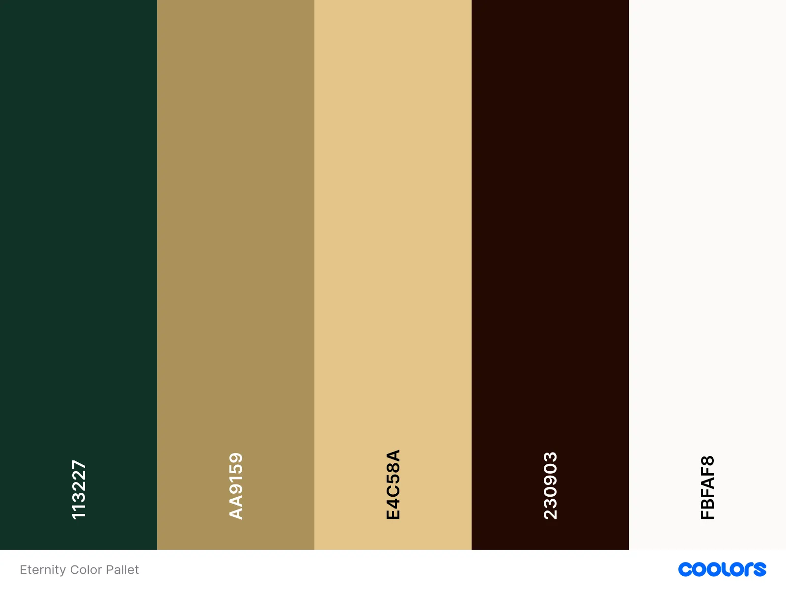

# Eternity - Luxury Watch Store

### Project Link

The live store is located at the following [address]().


## Agile Methodology

This project was executed using the Agile framework, promoting iterative progress and adaptability. The Agile approach was employed to plan and monitor the project's advancements. Agile principles were consistently applied through various tools and techniques:

**Planning and Monitoring:**

All user stories were systematically managed via GitHub Issues and Projects, ensuring an organised and methodical workflow.

**Custom Templates:**

Each user story was documented using custom templates, which included sections such as the user story, acceptance criteria, and tasks. This standardisation facilitated easier management and tracking of progress for each story.

**MoSCoW Prioritisation:**

To prioritise tasks, the MoSCoW method (Must have, Should have, Could have, and Won’t have) was utilised with labels. This prioritisation method helped categorise the importance of each user story, ensuring that essential features were developed first within an iteration, while less critical features were scheduled for later development if necessary. The implementation can be reviewed [here](https://github.com/KatePaulauskas/watch-store/issues).

**Kanban Board Management:** 

A Kanban board within GitHub Projects was used to manage user stories, divided into three columns: Todo, In Progress, and Done. This provided clear visibility into the project's status at any given time. The board can be viewed [here](https://github.com/users/KatePaulauskas/projects/4).

**Milestones and Iterative Progress:**

Milestones were established to define the project's iterations and were linked to the project epics. Each user story was allocated to one of six iterations, ensuring a structured development process and smooth progress tracking. The project milestones can be seen [here](https://github.com/KatePaulauskas/watch-store/milestones).

By leveraging these Agile practices and tools, the project maintained a clear and organised structure, allowing for effective tracking and timely completion of all 41 user stories.

## User Experience Design

The Eternity - Luxury Watch Store website was meticulously developed to cater to the needs of discerning customers seeking affordable luxury watches. By implementing a strategic approach that combines user-centric design and business objectives, the platform ensures an exceptional online shopping experience for luxury watch enthusiasts.

### Strategy

The foundation of the user experience was built by considering user needs and business objectives. The strategy focused on three main areas: identifying the target audience, defining clear business goals, and delivering value.

#### User Needs

Understanding the diverse needs of our users was essential. After thorough research, the **target audience** for the Eternity website was identified as follows:

* **Watch Collectors:** Individuals seeking affordable yet luxurious timepieces to enhance their collections.
* **Affordable Luxury Shoppers:** Customers looking for premium-quality watches that provide a sense of luxury without a high-end price tag.
* **Fashion Enthusiasts:** Individuals who view watches as key elements of their style and wardrobe.
* **Professionals:** Business people and executives who desire sophisticated and elegant timepieces that fit within their budget.
* **Watch Aficionados:** Enthusiasts who appreciate the craftsmanship and style of luxury watches at more accessible prices.
* **Gift Buyers:** Individuals searching for high-quality watches as special occasion gifts that offer great value.
* **International Clients:** Customers from around the globe seeking exclusive yet affordable watch brands and models.
* **Partners:** Jewelers and boutiques interested in potential partnerships and collaborations.

These users require a platform that offers comprehensive, reliable, high-quality information about affordable luxury watches, including product details, reviews, and a seamless purchasing experience.

#### Business Objectives

For Eternity, the primary business objectives include streamlining the purchase process, showcasing a curated selection of high-quality yet affordable watches, and establishing a strong online presence to attract and retain discerning customers. The brand’s commitment is to offer luxury watches that are both timeless and accessible, within a price range customers are comfortable and confident purchasing online.

**Goal**

The primary goal of the Eternity website is to streamline the watch purchasing process for customers while providing an inviting, informative, and efficient online presence that highlights the high-quality, affordable timepieces offered.

#### Focus, Definition, and Value

**Focus**

Eternity aims to simplify the watch purchasing process for customers. The key objectives include creating an inviting, informative, and efficient online presence that showcases the high-quality, affordable watches available at the store.

**Definition**

The website is designed to be a comprehensive online platform for Eternity that serves as an informative and user-friendly website for watch enthusiasts. Key features include:

- Detailed information about the store and its range of affordable luxury watches.
- An online purchasing system for browsing, selecting, and buying watches.
- Contact details and a form for inquiries.
- A visually appealing and easy-to-navigate interface.

**Value**

The value of the Eternity website is multi-faceted:

**For the Business:** The website will enhance the store’s online presence, streamline the purchase process, build a network of satisfied customers, and bolster the store's reputation for offering high-quality yet affordable products.

**For the Users:** Customers will gain confidence in the store's offerings through detailed product descriptions and reviews. They will enjoy the convenience of browsing and purchasing luxury watches online with options for extended warranties, ensuring a satisfying and trustworthy shopping experience.

By focusing on these key areas, the Eternity website aims to deliver a superior user experience that aligns with both business objectives and user needs.

### Scope

At the Scope Plane, features and content were developed by defining User Scenarios to understand how different users will interact with the site. This process involved creating Epics and User Stories to break down these scenarios into manageable tasks and features.

#### User Scenarios

**First Time Visitor:**

A new visitor can effortlessly navigate the website with a clear introduction and an intuitive menu. They can learn about the store's mission, browse the range of watches, and view a gallery of featured timepieces. They can also create an account and make their first purchase with ease.

**Returning Customer:**

Returning customers can quickly log in to their accounts to view and manage their orders, check their purchase history, and explore new arrivals or special offers.

**Potential Partners:**

Jewelers, boutiques, and other potential partners can find comprehensive information about the store's offerings and expertise. They can view the quality of the watches through the gallery and contact the store for potential collaborations using the dedicated contact form.

#### - User Stories -

##### **Epic 1: Home Page Experience**

 As a **user** I can **see an engaging and informative home page** so that **I can easily navigate the store and discover featured products**.

- **User Story: Home Page First Impression (above fold)**

     As a **user** I can **see a visually appealing homepage with store name, logo, tagline, high-quality image and call to action button** so that **I get a good first impression of the store**.
     <details>

     <summary>Acceptance Criteria</summary>

     - Given a user accesses the homepage
     - When the homepage loads
     - Then the user immediately sees the store name, logo, tagline, high-quality image relevant to the store business and call-to-action button prominently displayed.

     </details>

     <details>

     <summary>Tasks</summary>

     - Design the homepage layout using Bootstrap for responsive layout.
     - Add the store name, logo, and tagline.
     - Upload high-quality appealing image relevant to the store business.
     - Create and place call-to-action button.
     - Test the homepage for visual appeal and functionality.
     - Check the responsiveness and visual appeal across different devices to ensure a uniform experience, adjust layouts and font sizes as needed.

     </details>

     <br>

- **User Story: Navigation Menu**

     As a **user**, I can **access the navigation menu from any page** so that **I can easily access site pages and find what I’m looking for or discover what is available.**
     
     <details>

     <summary>Acceptance Criteria</summary>

     - Given a user accesses the site
     - When the homepage loads
     - Then the navigation menu is easily accessible in the header of the site
     - When a user clicks on any item in the site menu
     - Then the user is directed to the appropriate section or page of the site

     </details>

     <details>

     <summary>Tasks</summary>

     - Design and implement the navigation menu using Bootstrap for responsive layout.
     - Ensure all navigation links are working correctly.
     - Conduct user testing to ensure ease of navigation.
     - Check the responsiveness and visual appeal across different devices to ensure a uniform experience; adjust layouts and font sizes as needed.

     </details>

     <br>

- **User Story: Search Bar**

     As a **user**, I can **access the search functionality in the header of the site** so that **I can easily find what I’m looking for or discover what is available**.
     
     <details>

     <summary>Acceptance Criteria</summary>

     - Given a user accesses the site
     - When the homepage loads
     - Then the search bar is prominently placed in the header of the site and functional
     - Given a user uses the search bar
     - When a search is performed
     - Then the user receives relevant search results

     </details>

     <details>

     <summary>Tasks</summary>

     - Add and design a search bar in the header of the site.
     - Ensure the search functionality works correctly.
     - Conduct user testing to ensure the search bar is easy to find and use.
     - Check the responsiveness and visual appeal across different devices to ensure a uniform experience; adjust layouts and font sizes as needed.

     </details>

     <br>

- **User Story: Featured Products**

     As a **user**, I can view **featured products on the home page** so that **I can quickly see what products are popular.**
     
     <details>

     <summary>Acceptance Criteria</summary>

     - Given a user accesses the homepage
     - When the homepage loads
     - Then featured products are displayed prominently on the home page
     - Given a user clicks on a featured product
     - When the product name or image is clicked
     - Then the user is taken to the product detail page

     </details>

     <details>

     <summary>Tasks</summary>

     - Design and display featured products on the homepage in a gallery.
     - Link featured products to their detail pages.
     - Test the functionality of featured product links.
     - Check the responsiveness and visual appeal across different devices to ensure a uniform experience; adjust layouts and font sizes as needed.

     </details>

     <br>

- **User Story: Current Promotions and Offers**

     As a **user**, I can **view promotions and offers on the home page** so that **I can take advantage of existing deals.**
     
     <details>

     <summary>Acceptance Criteria</summary>

     - Given a user accesses the homepage
     - When the homepage loads
     - Then promotions and offers are highlighted

     </details>

     <details>

     <summary>Tasks</summary>

     - Display and highlight current promotions and offers on the homepage.
     - Check the responsiveness and visual appeal across different devices to ensure a uniform experience; adjust layouts and font sizes as needed.

     </details>

     <br>

- **User Story: Brand Connection**

     As a **user**, I can **read about the store, its goal, and mission on the home page** so that **I can connect with the values and vision of the business**.
     
     <details>

     <summary>Acceptance Criteria</summary>

     - Given a user accesses the homepage
     - When the homepage loads
     - Then the user can see a section that describes the store’s goal, mission, values, and vision.

     </details>

     <details>

     <summary>Tasks</summary>

     - Create and add to the homepage text about the store, its goals, values, mission, and vision.
     - Test the readability and accessibility of the information.
     - Check the responsiveness and visual appeal across different devices to ensure a uniform experience, and adjust layouts and font sizes as needed.

     </details>

     <br>

     - **User Story: Social Media Engagement**

     As a **user**, I can see **links to social media profiles in the footer of the site** so that **I can follow the brand and stay connected via social media platforms**.
     
     <details>

     <summary>Acceptance Criteria</summary>

     - Given a user accesses the homepage or any page of the site
     - When the page loads
     - Then the user can see links to the store’s social media profiles in the footer

     </details>

     <details>

     <summary>Tasks</summary>

     - Add social media profile links to the footer.
     - Ensure the links are functional.
     - Test the visibility and functionality of social media links.
     - Check the responsiveness and visual appeal across different devices to ensure a uniform experience, and adjust layouts and font sizes as needed.

     </details>

     <br>

- **User Story: Footer Menu and Contact Information**

     As a **user**, I can **easily access contact details and important links in the footer of the site** so that **I can get in touch with the store if needed and quickly navigate to key sections like Home, Shop, Terms & Conditions, Return Policy, Privacy Policy, and Get in Touch**.
     
     <details>

     <summary>Acceptance Criteria</summary>

     - Given a user accesses the homepage or any other page
     - When the page loads
     - Then the user can easily find the store’s contact details in the footer
     - And the user can access important links such as Home, Shop, Get in Touch, Terms & Conditions, Return Policy, and Privacy Policy from the footer menu

     </details>

     <details>

     <summary>Tasks</summary>

     - Add contact details to the footer of the site.
     - Add a footer menu with links to important pages such as Home, Shop, Get in Touch, Terms & Conditions, Return Policy, and Privacy Policy.
     - Ensure the contact information is accurate and up-to-date.
     - Test the visibility and functionality of the contact details.
     - Check the responsiveness and visual appeal across different devices to ensure a uniform experience, adjust layouts and font sizes as needed.

     </details>

     <br>

- **User Story: Customer Trust**

     As a **user**, I can **view customer reviews on the home page** so that **I learn about the quality of the products and level of service from other customers**.
     
     <details>

     <summary>Acceptance Criteria</summary>

     - Given a user accesses the homepage
     - When the homepage loads
     - Then the user can see customer reviews and gauge the quality of the store's products and the level of service.

     </details>

     <details>

     <summary>Tasks</summary>

     - Collect customer reviews.
     - Design a section to display customer reviews on the homepage.
     - Test the readability and accessibility of the reviews section.
     - Check the responsiveness and visual appeal across different devices to ensure a uniform experience, adjust layouts and font sizes as needed.

     </details>

     <br>

- **User Story: Newsletter Subscription**

     As a **visitor**, I can **sign up for a newsletter subscription** so that **I can receive regular updates, promotions, and news from the store**.
     
     <details>

     <summary>Acceptance Criteria</summary>

     - Given a visitor is on the home page or any other page of the site
     - When the visitor enters their email address in the subscription form in thee footer and submits it
     - Then the email address is added to the Mailchimp subscription list
     - And the visitor receives a confirmation message 

     </details>

     <details>

     <summary>Tasks</summary>

     - Utilize Mailchimp's embedded forms to handle subscriptions.
     - Display a success message upon successful subscription.
     - Display appropriate error messages if the subscription fails.
     - Test the subscription form functionality across different browsers and devices to ensure compatibility and responsiveness.

     </details>

- **User Story: Submit Contact Form Request**

    As a **user** I can **access and use the contact form on the 'Contact' page** so that **I can send inquiries directly to the store**.

    <details>

     <summary>Acceptance Criteria</summary>

     - Given a site, the user navigates to the "Contact" page
     - When the user looks at the page
     - Then the user sees a form to submit their name, email, and message
     - When the user fills out and submits the contact form
     - Then the user receives an on-screen confirmation that their message has been sent

     </details>

     <details>

     <summary>Tasks</summary>

     - Use Django Crispy Forms to create and style a contact form. Ensure the form collects the user's name, email, and message.
     - Style the form to make it visually appealing and consistent with the site’s overall design.
     - Ensure immediate feedback is provided to the user through an on-screen confirmation message upon successful submission of the form.
     - Test the form across multiple devices to ensure it is responsive and functions correctly.
     - Verify that confirmation messages and error handling are working as expected to provide a positive user experience.

      </details>


##### **Epic 2:  User Registration and Account Management**

 As a **shopper** I **can register and manage my account** so that **I can have a personalised shopping experience**.

- **User Story: Account Creation**

     As a **new customer**, I can **create a new account through the Log In bar** so that **I can view my profile and past purchases**.
     
     <details>

     <summary>Acceptance Criteria</summary>

     - Given an email, a customer can register an account
     - When the user enters their details and submits the form
     - Then the account is created and the user is redirected to the home page

     </details>

     <details>

     <summary>Tasks</summary>

     - Implement the user registration form using Django's authentication framework all-auth and Crispy Forms.
     - Set up validation for email uniqueness and password confirmation.
     - Set up error handling.
     - Create views and URLs for the registration form and redirection upon successful registration.
     - Test account creation functionality.
     - Check the responsiveness and visual appeal across different devices.

     </details>

     <br>

- **User Story: Account Creation Email Confirmation**

     As a **new customer**, I can **receive an email confirmation after registering an account** so that **I know my account setup was successful**.
     
     <details>

     <summary>Acceptance Criteria</summary>

     - Given a user registers a new account
     - When the registration is successful
     - Then an email confirmation is sent to the user

     </details>

     <details>

     <summary>Tasks</summary>

     - Implement email functionality in Django.
     - Design the email template.
     - Test email sending after registration.

     </details>

     <br>

- **User Story: Login Access**

     As an **existing customer**, I can **log in to my account** so that **I can access my account and purchase history**.
     
     <details>

     <summary>Acceptance Criteria</summary>

     - Given a user is on the login page
     - When the user enters their credentials and submits the form
     - Then the user is logged in and redirected to their account page

     </details>

     <details>

     <summary>Tasks</summary>

     - Implement the user login form using Django's authentication framework all-auth and Crispy Forms.
     - Create views and URLs for the login form and redirection upon successful login.
     - Test login functionality.
     - Check the responsiveness and visual appeal across different devices.

     </details>

     <br>

    - **User Story: Password Reset**

     As an **existing customer**, I can **reset my password if I forget it** so that **I can regain access to my account**.
     
     <details>

     <summary>Acceptance Criteria</summary>

     - Given a user clicks on the password reset link on the login form
     - When the user enters their email and submits the form
     - Then a password reset link is sent to their email

     </details>

     <details>

     <summary>Tasks</summary>

     - Design and implement the password reset form using Django's authentication framework all-auth and Crispy Forms.
     - Implement password reset logic in Django views.
     - Test password reset functionality.
     - Check the responsiveness and visual appeal across different devices.

     </details>

     <br>

- **User Story: Update Personal Details**

     As an **existing customer**, I can **update my personal details (name, address, payment information)** so that **my account information stays accurate and up to date**.
     
     <details>

     <summary>Acceptance Criteria</summary>

     - Given a user is on their account page
     - When the user updates their details and submits the form
     - Then the user's account information is updated

     </details>

     <details>

     <summary>Tasks</summary>

     - Design and implement the user account page.
     - Implement account update logic in Django views.
     - Test updating personal details functionality.
     - Check the responsiveness and visual appeal across different devices.

     </details>

     <br>

- **User Story: View Order History**

     As a **shopper**, I can **view my order history** so that **I can reference previous purchases**.
     
     <details>

     <summary>Acceptance Criteria</summary>

     - Given a shopper is logged into their account
     - When the shopper navigates to the order history page
     - Then a list of all previous orders is displayed

     </details>

     <details>

     <summary>Tasks</summary>

     - Design and implement the order history page using HTML, CSS, and Bootstrap for a responsive layout.
     - Implement logic in Django views to fetch and display order history.
     - Test the order history functionality.
     - Check the responsiveness and visual appeal across different devices.

     </details>

     <br>

##### **Epic 3: Product Browsing and Search**

 As a **user**, I can **browse and search for watches** so that **I can find products that meet my preferences**.

- **User Story: Shop Page**

     As a **user**, I can **access the shop page (all-products page) from the site menu** so that **I can view all available watches and apply filters to refine my search**.
     
     <details>

     <summary>Acceptance Criteria</summary>

     - Given a user accesses the all-products page directly, from the site menu, or call-to-action button
     - When the page loads
     - Then the user can see all available watches displayed in a gallery
     - When the user clicks on a product
     - Then the user is taken to the product detail page

     </details>

     <details>

     <summary>Tasks</summary>

     - Design the shop page and link it to the site menu.
     - Create Django model for watches with relevant fields (name, image, brand, price, gender, etc.).
     - Implement logic in Django views to fetch and display all watches.
     - Ensure products are linked to individual dynamic product pages.
     - Test the all-products page functionality.
     - Check the responsiveness and visual appeal across different devices to ensure a uniform experience.

     </details>

     <br>

- **User Story: Category Browsing**

     As a **user**, I can **browse watches by categories such as brand, gender, and price** so that **I can find what I’m looking for easily**.
     
     <details>

     <summary>Acceptance Criteria</summary>

     - Given a user is on the shop page
     - When the user selects a category filter
     - Then only products within that category are displayed

     </details>

     <details>

     <summary>Tasks</summary>

     - Implement category browsing functionality.
     - Integrate category filter logic into Django views.
     - Test category browsing functionality.
     - Check the responsiveness and visual appeal across different devices.

     </details>

     <br>

- **User Story: Keyword Search**

     As a **user**, I can **use the search bar to find specific watches by keyword or model number** so that **I can quickly locate desired products**.
     
     <details>

     <summary>Acceptance Criteria</summary>

     - Given a user is on any page
     - When the user enters a keyword in the search bar and submits
     - Then the search results matching the keyword are displayed

     </details>

     <details>

     <summary>Tasks</summary>

     - Implement search logic in Django views to filter products based on keywords.
     - Test keyword search functionality.
     - Check the responsiveness and visual appeal across different devices.

     </details>

     <br>

- **User Story: Filter Application**

     As a **user**, I can **apply filters (e.g., brand, gender, price range) on the all products page** so that **I can narrow down the selection**.
     
     <details>

     <summary>Acceptance Criteria</summary>

     - Given a user is on the product browsing page
     - When the user applies filters
     - Then the filtered results are displayed

     </details>

     <details>

     <summary>Tasks</summary>

     - Design and implement filter options using HTML, CSS, and Bootstrap for a responsive layout.
     - Implement filter logic in Django views.
     - Test filter application functionality.
     - Check the responsiveness and visual appeal across different devices.

     </details>

     <br>

- **User Story: Sort All Products Page Results**

     As a **user**, I can **sort search results by criteria like popularity, price, and newest** so that **I can view products in my preferred order**.
     
     <details>

     <summary>Acceptance Criteria</summary>

     - Given a user is on the product browsing page
     - When the user selects a sort option
     - Then the sorted results are displayed

     </details>

     <details>

     <summary>Tasks</summary>

     - Design and implement sort options using HTML, CSS, and Bootstrap for a responsive layout.
     - Implement sorting logic in Django views.
     - Test sorting functionality.
     - Check the responsiveness and visual appeal across different devices.

     </details>

     <br>

- **User Story: Product Category Sorting**

     As a **user**, I can **sort a specific category of products** so that **I can find the best-priced, newest, and most popular product in that category or sort the products in that category by name**.
     
     <details>

     <summary>Acceptance Criteria</summary>

     - Given a user is on the all products page
     - When the user selects a sort option within a category
     - Then the sorted results are displayed within that category

     </details>

     <details>

     <summary>Tasks</summary>

     - Design and implement category-specific sort options using HTML, CSS, and Bootstrap for a responsive layout.
     - Implement category-specific sorting logic in Django views.
     - Test category-specific sorting functionality.
     - Check the responsiveness and visual appeal across different devices.

     </details>

     <br>

- **User Story: Search Query and Result Count Display**

     As a **user**, I can **clearly see my search query and the total number of results** so that **I can assess if the desired product is offered by the store**.
     
     <details>

     <summary>Acceptance Criteria</summary>

     - Given a user performs a search
     - When the search results are displayed
     - Then the search query and number of results are clearly shown

     </details>

     <details>

     <summary>Tasks</summary>

     - Display the search query and result count using HTML, CSS, and Bootstrap for a responsive layout.
     - Ensure search clarity in Django views.
     - Test the display of search query and result count.
     - Check the responsiveness and visual appeal across different devices.

     </details>

     <br>

##### **Epic 4: Product Details**

 As a **shopper**, I can **view detailed information about watches** so that **I can make informed purchasing decisions**.

- **User Story: Product Page**

     As a **shopper**, I can **see detailed product descriptions, specifications, and images** so that **I can understand the product features**.
     
     <details>

     <summary>Acceptance Criteria</summary>

     - Given a shopper is on the product detail page
     - When the page loads
     - Then the shopper can see detailed descriptions, specifications, and images

     </details>

     <details>

     <summary>Tasks</summary>

     - Design and implement the product detail page using HTML, CSS, and Bootstrap for a responsive layout.
     - Populate the product detail page with descriptions, specifications, and images.
     - Test the display of product details.
     - Check the responsiveness and visual appeal across different devices.

     </details>

     <br>

- **User Story: Products' Reviews**

     As a **shopper**, I can **view customer reviews and ratings** so that **I can gauge the quality and satisfaction of other buyers**.
     
     <details>

     <summary>Acceptance Criteria</summary>

     - Given a shopper is on the product detail page
     - When the page loads
     - Then the shopper can see customer reviews and ratings

     </details>

     <details>

     <summary>Tasks</summary>

     - Design and implement the customer review section using HTML, CSS, and Bootstrap for a responsive layout.
     - Integrate customer reviews and ratings in Django models.
     - Populate the review section with sample reviews and ratings.
     - Test the display and functionality of customer reviews.
     - Check the responsiveness and visual appeal across different devices.

     </details>

     <br>

- **User Story: Extended Warranty Add-On**

     As a **shopper**, I can **opt for an extended warranty for a watch** so that **I have additional protection and peace of mind beyond the standard warranty period**.
     
     <details>

     <summary>Acceptance Criteria</summary>

     - Given a shopper is on the product detail page
     - When the page loads
     - Then the shopper can see an option to add an extended warranty
     - When the shopper clicks on the add-on to extend the warranty
     - Then the total price of the product adjusts to include the additional charge

     </details>

     <details>

     <summary>Tasks</summary>

     - Design and implement the extended warranty option using HTML, CSS, and Bootstrap for a responsive layout on the product detail page.
     - Integrate the extended warranty feature in Django models to support the add-on.
     - Create and display a detailed description of the extended warranty terms and conditions on the product detail page.
     - Develop functionality to adjust the total product price when the extended warranty is selected.
     - Ensure the new total price includes the additional charge for the extended warranty.
     - Test the display and functionality of the extended warranty option across various devices and screen sizes.
     - Validate that the price adjustment works correctly and is reflected in the shopping cart and checkout process.

     </details>

     <br>

- **User Story: Select Product Options**

     As a **shopper**, I can **select product options and quantity** so that I can **customize my purchase before adding it to the cart**.
     
     <details>

     <summary>Acceptance Criteria</summary>

     - Given a shopper is on a product detail page
     - When the page loads
     - Then the shopper can see options to select product attributes and quantity
     - When the shopper selects product attributes and quantity
     - Then the selections are captured correctly and can be added to the cart

     </details>

     <details>

     <summary>Tasks</summary>

     - Design and implement product option selectors (e.g., dropdowns, radio buttons) using HTML, CSS, and Bootstrap for a responsive layout.
     - Ensure the quantity selector is intuitive and user-friendly.
     - Integrate the selection functionality in Django models and views to capture and process the selected attributes and quantity.
     - Test the selection functionality to ensure the options and quantity are accurately captured and processed.
     - Validate the visual appeal and responsiveness of the product option selectors across different devices.
     - Provide feedback to the user in case of invalid selections or errors (e.g., out-of-stock options).

     </details>

     <br>

##### **Epic 5: Shopping Cart and Checkout**

 As a **shopper**, I can **manage my shopping cart and complete purchases** so that **I can buy watches conveniently**.

- **User Story: Add Items to Cart**

     As a **shopper**, I can **add items to my shopping cart** so that **I can purchase them later**.
     
     <details>

     <summary>Acceptance Criteria</summary>

     - Given a user is on a product page
     - When the user selects the product option and quantity and then clicks the "Add to Cart" button
     - Then a pop-up notification is displayed and the item is added to the shopping cart

     </details>

     <details>

     <summary>Tasks</summary>

     - Design and implement the "Add to Cart" button using HTML, CSS, and Bootstrap for a responsive layout.
     - Ensure the selected product options and quantity are correctly captured and sent to the backend.
     - Implement add-to-cart functionality in Django views.
     - Develop the pop-up notification to confirm the item has been added to the cart.
     - Test the add-to-cart functionality.
     - Validate that the cart is updated correctly and displayed accurately in the shopping cart summary.
     - Provide feedback to the user in case of errors (e.g., out of stock) when adding items to the cart.
     - Check the responsiveness and visual appeal across different devices.

     </details>

     <br>

- **User Story: Review Cart**

     As a **shopper**, I can **view the contents of my shopping cart and the total amount** so that **I can review my selections and total cost before proceeding to checkout**.
     
     <details>

     <summary>Acceptance Criteria</summary>

     - Given a shopper accesses the shopping cart page
     - When the page loads
     - Then the shopper can see all items in the cart with their details and prices
     - And the shopper can see the total cost of all items in the cart

     </details>

     <details>

     <summary>Tasks</summary>

     - Design and implement the shopping cart page using HTML, CSS, and Bootstrap for a responsive layout.
     - Implement logic in Django views to retrieve and display cart contents.
     - Display each item's details, including name, quantity, price, and any selected options.
     - Calculate and display the total cost of all items in the cart.
     - Test the display and functionality of the shopping cart, ensuring items and total cost are shown accurately.
     - Validate the cart's responsiveness and visual appeal across different devices.

     </details>

     <br>

- **User Story: Update Cart**

     As a **shopper**, I can **remove or update quantities of items in my cart** so that I can **adjust my order**.
     
     <details>

     <summary>Acceptance Criteria</summary>

     - Given a shopper is on the shopping cart page
     - When the shopper updates quantities or removes items
     - Then the cart reflects the changes

     </details>

     <details>

     <summary>Tasks</summary>

     - Implement functionality to update quantities and remove items in the cart using HTML, CSS, and Bootstrap for a responsive layout.
     - Update Django views to handle cart updates.
     - Ensure the cart dynamically updates the total cost when changes are made.
     - Provide user feedback for any errors or issues (e.g., items out of stock) when viewing or updating the cart.
     - Test the update and removal functionality.
     - Check the responsiveness and visual appeal across different devices.

     </details>

     <br>

- **User Story: Add Customer Details at Checkout**

     As a **shopper**, I can **enter my customer details during checkout** so that I can **complete my purchase**.
     
     <details>

     <summary>Acceptance Criteria</summary>

     - Given a shopper is on the checkout page
     - When the shopper enters their customer details
     - Then the customer details are saved and used for the order

     </details>

     <details>

     <summary>Tasks</summary>

     - Design and implement the customer details form using HTML, CSS, and Bootstrap for a responsive layout.
     - Implement logic in Django views to save the customer details.
     - Test the customer details entry functionality.
     - Check the responsiveness and visual appeal across different devices.

     </details>
     
     <br>

- **User Story: Enter Shipping Address at Checkout**

     As a **shopper**, I can **enter my shipping address** so that **my order can be delivered to me**.
     
     <details>

     <summary>Acceptance Criteria</summary>

     - Given a shopper is on the checkout page
     - When the shopper enters their shipping address
     - Then the shipping address is saved and used for the order

     </details>

     <details>

     <summary>Tasks</summary>

     - Design and implement the shipping address form using HTML, CSS, and Bootstrap for a responsive layout.
     - Implement logic in Django views to save the shipping address.
     - Test the shipping address entry functionality.
     - Check the responsiveness and visual appeal across different devices.

     </details>

     <br>

- **User Story: Offer Login at Checkout**

     As a **shopper**, I can **be prompted to log in at checkout** so that I can **prefill my details if I have an account**.
     
     <details>

     <summary>Acceptance Criteria</summary>

     - Given a shopper is on the checkout page and not logged in
     - When the page loads
     - Then the shopper is offered the option to log in
     - When the shopper logs in
     - Then their customer details are prefilled in the relevant fields

     </details>

     <details>

     <summary>Tasks</summary>

     - Design and implement the login prompt on the checkout page using HTML, CSS, and Bootstrap for a responsive layout.
     - Implement logic in Django views to handle shopper login and retrieval of customer details.
     - Ensure customer details are prefilled upon successful login.
     - Test the login prompt and prefill functionality.
     - Check the responsiveness and visual appeal across different devices.

     </details>

     <br>

- **User Story: Prefill Customer and Shipping Details**

     As a **shopper**, I can **have my customer and shipping details prefilled if I'm logged in** so that **I can save time during the checkout process**.
     
     <details>

     <summary>Acceptance Criteria</summary>

     - Given a shopper is logged in and on the checkout page
     - When the page loads
     - Then the shopper’s customer and shipping details are prefilled in the relevant fields

     </details>

     <details>

     <summary>Tasks</summary>

     - Design and implement the customer and shipping details form using HTML, CSS, and Bootstrap for a responsive layout.
     - Implement logic in Django views to retrieve and prefill customer and shipping details if the shopper is logged in.
     - Test the prefill functionality to ensure details are correctly populated.
     - Check the responsiveness and visual appeal across different devices.

     </details>

     <br>

- **User Story: Choose the Shipping Method at Checkout**

     As a **shopper**, I can **choose a shipping method** so that I can **select how my order will be delivered to me**.
     
     <details>

     <summary>Acceptance Criteria</summary>

     - Given a shopper is on the checkout page
     - When the shopper selects a shipping method
     - Then the selected shipping method is saved and used for the order

     </details>

     <details>

     <summary>Tasks</summary>

     - Design and implement the shipping method selection using HTML, CSS, and Bootstrap for a responsive layout.
     - Implement logic in Django views to save the selected shipping method.
     - Test the shipping method selection functionality.
     - Check the responsiveness and visual appeal across different devices.

     </details>

     <br>

- **User Story: Add Payment Information at Checkout**

     As a **shopper**, I can easily **enter my payment information** so that I can **check out quickly and with no hassles**.
     
     <details>

     <summary>Acceptance Criteria</summary>

     - Given a shopper is on the checkout page
     - When the shopper enters their payment information
     - Then the payment information is processed securely

     </details>

     <details>

     <summary>Tasks</summary>

     - Design and implement the payment information form using HTML, CSS, and Bootstrap for a responsive layout.
     - Integrate Stripe payment gateway in Django views.
     - Test the payment information entry and processing functionality.
     - Check the responsiveness and visual appeal across different devices.

     </details>

     <br>

- **User Story: Payment Security**

     As a **shopper**, I can **feel my personal and payment information is safe and secure** so that I can **provide the required information in confidence to complete my purchase**.
     
     <details>

     <summary>Acceptance Criteria</summary>

     - Given a shopper is on the checkout page
     - When the shopper enters their payment information
     - Then the information is encrypted and processed securely

     </details>

     <details>

     <summary>Tasks</summary>

     - Ensure Stripe uses secure protocols.
     - Test the security measures for payment information.
     - Check the responsiveness and visual appeal across different devices.

     </details>

     <br>

- **User Story: Order Confirmation Page**

     As a **shopper**, I can **view an order confirmation page after checkout** so that I can **verify that my order was accepted and I haven't made any mistakes**.
     
     <details>

     <summary>Acceptance Criteria</summary>

     - Given a shopper completes the checkout process
     - When the order is successfully placed
     - Then the shopper is redirected to an order confirmation page with the order details

     </details>

     <details>

     <summary>Tasks</summary>

     - Design and implement the order confirmation page using HTML, CSS, and Bootstrap for a responsive layout.
     - Implement logic in Django views to display order details.
     - Test the order confirmation page functionality.
     - Check the responsiveness and visual appeal across different devices.

     </details>

     <br>

- **User Story: Order Email Confirmation**

     As a **shopper**, I can **receive an order confirmation via email** so that **I have proof of my purchase**.
     
     <details>

     <summary>Acceptance Criteria</summary>

     - Given a shopper completes the checkout process
     - When the order is successfully placed
     - Then an email confirmation is sent to the shopper

     </details>

     <details>

     <summary>Tasks</summary>

     - Implement email functionality in Django.
     - Design the email template for order confirmation.
     - Test email sending after order placement.

     </details>

     <br>

##### **Epic 6: Admin and Store Management**
 
 As an **admin** I can **manage the products in the store** so that **I can keep the inventory up-to-date and relevant**.

- **User Story: Add a Product as Admin**

     As **an admin**, I can **add a product** so that **I can include new items in the store inventory**.
     
     <details>

     <summary>Acceptance Criteria</summary>

     - Given an admin is logged into the site
     - When the admin navigates to the add product page and enters product details
     - Then the new product is added to the store inventory

     </details>

     <details>

     <summary>Tasks</summary>

     - Design and implement the add product form using HTML, CSS, and Bootstrap for a responsive layout.
     - Create Django models for products.
     - Implement logic in Django views to handle adding products.
     - Test the add product functionality.
     - Check the responsiveness and visual appeal across different devices.

     </details>

     <br>

- **User Story: Edit/Update a Product as Admin**

     As an **admin**, I can **edit or update a product** so that **I can change product prices, descriptions, images, and other product criteria**.
     
     <details>

     <summary>Acceptance Criteria</summary>

     - Given an admin is logged into the site
     - When the admin navigates to the edit product page and updates product details
     - Then the product details are updated in the store inventory

     </details>

     <details>

     <summary>Tasks</summary>

     - Design and implement the edit product form using HTML, CSS, and Bootstrap for a responsive layout.
     - Implement logic in Django views to handle editing products.
     - Test the edit product functionality.
     - Check the responsiveness and visual appeal across different devices.

     </details>

     <br>

- **User Story: Delete a Product as Admin**

     As an **admin**, I can **delete a product** so that **I can remove items that are no longer available**.
     
     <details>

     <summary>Acceptance Criteria</summary>

     - Given an admin is logged into the site
     - When the admin navigates to the delete product page and confirms the deletion
     - Then the product is removed from the store inventory

     </details>

     <details>

     <summary>Tasks</summary>

     - Design and implement the delete product confirmation using HTML, CSS, and Bootstrap for a responsive layout.
     - Implement logic in Django views to handle deleting products.
     - Test the delete product functionality.
     - Check the responsiveness and visual appeal across different devices.

     </details>

     <br>

- **User Story: Store Policies Management**

     As an **admin** I can **update the content for Terms & Conditions, Return Policy, and Privacy Policy through both the admin panel and the front end** so that **the footer menu always provides accurate and up-to-date information for users.**
     
     <details>

     <summary>Acceptance Criteria</summary>

     - Given an admin is logged into the site
     - When the admin navigates to the admin panel
     - Then the admin can update the content for the Terms & Conditions, Return Policy, and Privacy Policy pages
     - When the content is updated
     - Then the footer menu automatically links to the updated content
     - Given an admin is logged into the site
     - When the admin navigates to the front-end pages of Terms & Conditions, Return Policy, or Privacy Policy
     - Then the admin can directly edit the content on those pages without needing to access the admin panel

     </details>

     <details>

     <summary>Tasks</summary>

     - Create a model to store the content for Terms & Conditions, Return Policy, and Privacy Policy.
     - Add editable fields for Terms & Conditions, Return Policy, and Privacy Policy in the admin panel.
     - Implement front-end editing capabilities for Terms & Conditions, Return Policy, and Privacy Policy pages accessible only to logged-in admin.
     - Implement logic to display the updated content on the respective pages linked in the footer menu.
     - Ensure the footer menu remains consistent and functional across all pages.
     - Test the ability to update content through both the admin panel and the front-end pages and verify the links in the footer menu reflect these changes.
     - Check the responsiveness and visual appeal of the footer menu across different devices.

     </details>

- **User Story: Store Contact Form Requests**

    As an **admin** I can **store contact form requests in the database** so that **I can review them, and mark them as read or delete them**.

    <details>

    <summary>Acceptance Criteria</summary>

     - Given a site user submits the contact form
     - When the form data is sent to the server
     - Then the data should be stored in the database securely
     - And the admin should be able to access and review this submission


    </details>

     <details>

     <summary>Tasks</summary>

     - Create a database model for storing contact requests. Include fields for name, email, message, submission date, and a status field to track whether the request has been read.
     - Implement functionality to capture and store data from the form submissions.
     - Use Django’s built-in protections against Cross-Site Request Forgery (CSRF) to secure form submissions.
     - Utilize Django’s admin interface to create a custom panel where submitted requests can be reviewed.
     - Ensure that the admin panel is intuitive and allows the site owner to easily manage the contact requests.
     - Conduct thorough testing to ensure that form data is correctly captured, securely stored, and easily accessible via the admin panel.

     </details>

- **User Story: Track Contact Form Submissions**

    As an **admin** I can **mark contact form submission as "read"** so that **I can track how many I still need to process**.

    <details>

    <summary>Acceptance Criteria</summary>

    - Given admin is reviewing contact form submissions in the admin panel
    - When the admin selects a request
    - Then the admin should be able to mark it as "read"

    </details>

    <details>

    <summary>Tasks</summary>

    - Enhance the existing admin panel to include an option to mark and unmark contact requests as "read."
    - Verify that the functionality works seamlessly and the status updates are preserved when exiting and re-entering the admin panel.

    </details>


### Structure

At the Structure Plane, the information organisation and interaction design were developed by defining the site pages, database structure, and booking flow. 

#### - Site Pages -

The Eternity Luxury Watch Store comprises of several key pages, each designed to provide essential information and facilitate positive and engaging user experience:

**Home Page:**

**Shop Page:**

**Product Page:**

**Cart Page**

**Checkout Page**

**Contact Page:**

* Contains a contact form for inquiries, collaborations and feedback.

**Log In and Sign Up Pages:**

* Enables users to create an account or log in to access personalised experience.
* Facilitates order management tracking.

#### - Database Structure -

The Database Structure below visualises the relationships between the key models of the project. The database schema is designed to effectively manage purchasing process.


### Skeleton

At the Skeleton Plane, the interface and navigation design were defined through wireframes.


#### Wireframes

The initial layout of the interface and navigation for the Eternity Luxury Watch Store website was developed using Balsamiq Studios software, where mockup wireframes were created for the key pages.

**Home page:**


**Shop Page:**


**Product Page:**


**Cart Page**


**Checkout Page**


**Contact page:**


**Log In page:**


**Sign Up page:**


### Surface
At the Surface Plane, the visual design of the site was developed, with a strong focus on the overall look and feel of the site.

#### Colour Scheme

The colours for the Eternity Luxury Watch Store site were carefully chosen using the [Coolors tool](https://coolors.co/) to establish a brand identity that exudes both luxury and sophistication. 



Each color plays a critical role in creating an inviting and refined user experience, while also ensuring that the website conveys the premium quality of the products.

- **Dark Green (#113227ff):** Serving as the primary background color, dark green was chosen for its association with wealth, stability, and timeless elegance. This deep, rich tone provides a strong foundation that enhances the perception of luxury and makes the site feel both exclusive and grounded.

- **Ecru (#e4c58aff):** Ecru is used for most of the text and main accents across the site. Its warm, neutral tone ensures readability while adding a touch of understated elegance. This color complements the darker background, creating a harmonious balance that is both inviting and visually pleasing.

- **Lion (#aa9159ff), Licorice (#230903ff), and Seasalt (#fbfaf8ff):** These colors are strategically employed throughout the site to add contrast and highlight important elements. The rich and sophisticated tones of lion and licorice, paired with the soft and clean seasalt, ensure that the overall design remains luxurious while also being visually dynamic and engaging. These colors work together to create a cohesive aesthetic that reflects the brand’s commitment to quality and timeless elegance.

The combination of these carefully selected colors creates a cohesive and luxurious aesthetic that embodies the brand’s dedication to offering timeless, high-quality watches. The palette strikes a balance between bold, rich tones and elegant neutrals, ensuring that the website appeals to discerning customers who value both style and substance.

#### Typography

The fonts for the Eternity Luxury Watch Store site were thoughtfully chosen using the font pairing service [Font Joy](https://fontjoy.com/) to ensure a visually appealing and cohesive design. Each font was selected to enhance the user experience and reflect the brand's identity.


Choosing the right fonts is essential for conveying the luxury and sophistication that aligns with the brand's identity. The selected fonts for the Eternity Luxury Watch Store have been chosen to reflect elegance, readability, and a modern aesthetic. Below is an explanation of the selected fonts and why they are suitable for the site:

1. **Primary Heading Font: "Cormorant Unicase" (Serif)**
   
   - **Elegance and Uniqueness:** Cormorant Unicase is a serif font that brings a touch of classical elegance with a unique twist. The unicase design, where uppercase and lowercase letters share similar heights, adds a distinct character that makes the headings stand out. This is particularly important for luxury brands, where uniqueness and attention to detail are highly valued.
   - **Luxurious Appeal:** The fine strokes and sophisticated letterforms of Cormorant Unicase resonate with the luxury market, aligning with the timeless and refined nature of high-end watches. It sets a distinguished tone for the brand, making it ideal for the main headings (H1).

2. **Secondary Heading Font: "Antic" (Sans-Serif)**
   
   - **Simplicity and Clarity:** Antic is a sans-serif font that offers a clean, modern look. It is straightforward and highly legible, which makes it an excellent choice for secondary headings (H2-H6). Its simplicity complements the more ornate Cormorant Unicase, creating a balanced visual hierarchy on the page.
   - **Modern Touch:** While Cormorant Unicase delivers a classic feel, Antic introduces a modern touch, ensuring the website resonates with contemporary audiences. This fusion of traditional and modern elements mirrors the brand's dedication to offering luxury watches that are timeless, innovative and accessible.

3. **Body Text Font: "Muli" (Sans-Serif)**
   
   - **Readability and Functionality:** Muli is a sans-serif font that is optimized for on-screen readability. It’s clean and minimalistic, which makes it ideal for large blocks of text, such as product descriptions and informational content. The font ensures that the text is easy to read, enhancing the user experience.
   - **Subtle and Neutral:** Muli's subtle design does not distract from the content, allowing the luxury watches to remain the focal point. Its neutral appearance complements the more expressive heading fonts, ensuring a cohesive and harmonious overall design.

#### Visual Representation of Font Pairing

- **Headings (H1):** Cormorant Unicase
- **Subheadings (H2-H6):** Antic
- **Body Text (Paragraphs):** Muli

These fonts were selected to create a visual hierarchy that conveys luxury, clarity, and modernity. **Cormorant Unicase** adds a unique and elegant touch to the primary headings, making a strong brand statement. **Antic** provides simplicity and modernity to the secondary headings, ensuring that the design remains clean and accessible. Finally, **Muli** ensures that all body text is highly readable and functional, supporting a seamless user experience across the site.

By integrating these fonts, the Eternity Luxury Watch Store website can effectively communicate its brand values of elegance, precision, and timelessness, while also offering a modern and user-friendly interface.

**Backdrop Font**

In addition to the selected fonts, the backdrop font across the website is also sans-serif. This backdrop enhances the modern and clean aesthetic, supporting the visual hierarchy and helping foreground content pop against a clear, unobtrusive background.

## Features

### Existing Features

### Header

The header of the Eternity Luxury Watch Store website is designed to provide essential functionality and enhance user experience. It includes a search bar, shopping cart icon, and account icon, all prominently positioned for easy access. The logo, representing the brand's identity, is centered in the header to ensure strong brand recognition.

On the left side of the header, the navigation bar allows users to explore the site with ease. The search bar, cart icon, and account icon are aligned on the right, offering quick access to product searches, shopping cart overview, and account management. These elements ensure that users can efficiently browse and manage their shopping experience.


### Navigation Bar

The fully responsive navigation bar is displayed across all site pages, allowing seamless navigation throughout the website. It includes links to the main site sections: Home, Shop, Brands, and Contact. The design remains consistent across all devices, ensuring a cohesive user experience.

* **Desktop View:**
  
  The navigation bar links are displayed horizontally, with the active page highlighted to indicate the user's current location on the site.

  

* **Tablet and Mobile View:**
  
  On tablets and mobile devices, the navigation bar is represented by a hamburger icon. Clicking on this icon reveals a drop-down menu with the current page highlighted, ensuring smooth navigation. The search bar, cart, and account icons are prominently displayed for easy access.

  

### Above the Fold

When users first visit the Eternity Luxury Watch Store website, they are greeted with an inviting hero image featuring a luxury watch. This section is designed to captivate the user’s attention immediately, creating a strong first impression of the store's curated selection of high-quality timepieces.


### About Us

The About Us section provides visitors with a comprehensive overview of the brand's mission and vision. It emphasizes Eternity's commitment to offering affordable luxury watches. This section builds trust and fosters a connection with potential customers by highlighting the brand’s dedication to quality and customer satisfaction.


### Shop Page

### Product Page

### Cart Page

### Checkout Page

### Contact Us Page

The Contact Us Page provides a user-friendly contact form for inquiries, collaborations and feedback. This page is designed to facilitate smooth communication between Eternity Luxury Watch Store and its customers and potential partners, allowing them to easily reach out with any questions or concerns regarding their purchases or collaboration offers.


Upon submitting a request through the form, the user receives a notification confirming successful submission, and the form is refreshed in case the user wishes to send another request:


### Log In Page

The Log In page allows existing customers to access their accounts and view their orders. This page ensures secure authentication and provides a straightforward way for users to log in and access personalised experience. There is also a prompt to reset their password if needed.


After logging in, customers are directed to their account dashboard and notified of a successful login:


### Sign Up Page

If a customer does not have an existing account, they can click on the 'Sign Up' link on the Log In page. They are then redirected to the Sign Up page, which allows new users to create an account, enabling them to track their orders and manage their account details online.


If a user does not follow the recommendations for creating secure credentials, notifications appear in a bright color to draw their attention to the issue and help them correct it.


After signing up, customers are directed to their account dashboard and notified of their successful account creation:


### Log Out Page

Upon clicking the Log Out button in the header, the user is taken to the Log Out page, where they must confirm their intent to sign out:


Upon confirmation, the user is redirected to the home page and notified of their successful action:


### Footer

The footer is displayed at the bottom of every page and contains essential information and links:

* **Contact Information:** Phone number and email address for customer inquiries.
* **Social Media Links:** Icons linking to Eternity's Instagram and Facebook pages, allowing customers to connect with the brand on social platforms.
* **Subscribe Form:** A subscription form where users can enter their email addresses to receive newsletters, promotions, and updates from Eternity. This helps build a loyal customer base and keeps users informed about new arrivals and special offers.
* **Footer Menu:** A compact menu providing quick links to important pages such as Home, Shop, Contact, Terms & Conditions, Return Policy and Privacy Policy. This menu ensures that users can easily navigate to key sections of the site from any page.


### Custom Error Pages

To enhance the user experience, custom error pages for 404 and 500 errors have been implemented. These error pages provide clear and helpful messages when users encounter a broken link or an internal server error. By guiding users back to the home page or other key sections, these error pages help maintain a seamless browsing experience even in the event of an error.


### Admin Access Features

### Future Features

## Technologies used

### Languages

### Libraries and Frameworks

### Technologies

#### Dependencies

## Testing

### Manual Testing
#### Site features and behaviour

| Action/Feature          | Expected Behavior       | Status         |
|-------------------------|-------------------------|----------------|

#### User Stories
| User Story | Expected Behaviour | Actual Behaviour | Status |
|------------|-------------------|----------------|-----------|

### Validator Testing

#### HTML
<details>
  <summary>HTML Testing</summary>

To ensure adherence to web standards and improve accessibility, the site's HTML was submitted to [W3C validation testing]().

</details>

#### CSS

<details>
  <summary>CSS Testing</summary>

For compliance with web standards and accessibility guidelines, the site's CSS code was checked using the [(Jigsaw) validator](). 

</details>

#### JavaScript

<details>
  <summary>JavaScript Testing</summary>

To enhance adherence to web standards and ensure accessibility, the site's JavaScript code was validated using the [JSHint Validator](https://jshint.com/). 

</details>

#### Python

<details>
  <summary>Python Testing</summary>

To ensure conformity with web standards and accessibility requirements, the site's Python code from every relevant file was tested using the [PEP8 Python Validator](https://pep8ci.herokuapp.com). 

</details>

### Responsivness

<details>
  <summary>Responsivness Testing</summary>

</details>

### Lighthouse Testing

<details>
  <summary>Lighthouse Testing</summary>

To ensure the accessibility requirements are met for the current project, Lighthouse testing was conducted for the site

</details>

### Accessibility Testing

<details>
  <summary>Accessibility Testing</summary>

The accessibility of the site was tested using the [Adoby Color Contrast Checker](https://color.adobe.com/create/color-contrast-analyzer).


The site's colours were also evaluated for accessibility to ensure they are safe for color-blind users using the [Adoby Color accessibility tool](https://color.adobe.com/create/color-accessibility), which returned the result: 'No conflicts found. Swatches are color-blind safe'.


</details>

### Bugs

#### Solved Bugs

#### Remaining Bugs

## Deployment

The luxury watch store Eternity website is hosted on [Heroku](https://heroku.com), a container-based cloud platform designed for app development, deployment, and management. It was deployed following the steps below.

### Part 1: Create a New App

1. **Log into [Heroku](https://heroku.com) Account**

2. **Create a New App:**
- Select 'New' in the top-right corner of the Heroku Dashboard.
- Choose 'Create new app' from the drop-down menu.
- Enter the app name 'eternity-watch-store' and select Europe as the region.
- Click 'Create App'.

3. **Access Settings and Configure Environment Variables:**
- Go to the 'Settings' tab of the created app.
- Click on 'Config Vars'.
- Add the `DISABLE_COLLECTSTATIC` key with a value of `1`.
- Click 'Add'.
- Add the `SECRET_KEY` with a value in the following format: `secret key`.
- Click 'Add'.

### Part 2 - Update Code for Deployment

1. **Prepare Dependencies:**
- In the workspace terminal, run the command to create a `requirements.txt` file with the project's dependencies for each project dependency, while working on the project:

```
    pip3 freeze --local > requirements.txt
```

2. **Install Gunicorn:**
- Install the web server Gunicorn:

```
    pip3 install gunicorn~=20.1
```

- Add Gunicorn to the project requirements:

```
    pip3 freeze --local > requirements.txt
```

3. **Create a Procfile:**
- Create a `Procfile` at the root directory of the project.
- Declare the process as `web` and add a start command:

```
    web: gunicorn watch-store.wsgi
```

4. **Update Project settings.py File:**
- Change `DEBUG` to `False`:

```
    DEBUG = False
```

- Add `'.herokuapp.com'` to the `ALLOWED_HOSTS` in the project settings:

```
     ALLOWED_HOSTS = [
    '8000-katepaulausk-watchstore-26htz3q089y.ws.codeinstitute-ide.net',
    '.herokuapp.com']
```

5. **Push Updated Code to GitHub**

### Part 3 - Deployment with Static Files

To ensure the deployed app looks as nicely styled as the local development version, the project was deployed with static files using the WhiteNoise Python package by following the steps below:

1. **Install and Set Up the Python Package:**

- Install WhiteNoise:

```
    pip3 install whitenoise~=5.3.0
```

- Add WhiteNoise to the project requirements:

```
    pip3 freeze --local > requirements.txt
```

- Integrate WhiteNoise into Django's `MIDDLEWARE` in the `groomingsalon/settings.py` file, ensuring it is placed right after the Django `SecurityMiddleware`:
```
     MIDDLEWARE = [
         'django.middleware.security.SecurityMiddleware',
         'whitenoise.middleware.WhiteNoiseMiddleware',
         # Other middleware...
     ]
```

2. **Create a Static Files Directory and Collect Static Files:**
- Set the `STATIC_ROOT` path in the `groomingsalon/settings.py` file:

```
    STATIC_ROOT = os.path.join(BASE_DIR, 'staticfiles')
```

- Run the `collectstatic` command in the terminal to gather static files into the `staticfiles` directory:

```
    python3 manage.py collectstatic
```

3. **Deployment:**

- Check the Python version by running:

```
    python3 -V
```

- From the [supported runtimes](https://devcenter.heroku.com/articles/python-support#specifying-a-python-version), copy the runtime closest to the current Python version.

- Add a `runtime.txt` file to the project's root directory with the copied Python version: `python-3.12.5`.

- Set `DEBUG` to `False` and push the changes to GitHub.

- Open the Heroku dashboard, go to the app 'Settings' tab, and under 'Reveal config vars', remove the `DISABLE_COLLECTSTATIC` key/value pair.

### Part 4 - Set Up Deployment from GitHub

1. **Set Up Deployment from GitHub:**

- In the Heroku dashboard, switch to the 'Deploy' tab.

- Choose 'GitHub' as the deployment method and connect the GitHub account.

- In the search bar, type the repository name `watch-store` and click 'Search' to find it on GitHub.

- Click 'Connect' to link the Heroku app to the GitHub repository.

2. **Deploy the App:**
- Click 'Deploy Branch' to manually deploy the app.

- Wait for the app to build. Once ready, the message “Your app was successfully deployed” appears.

3. **View Deployed App:**

- Click on the 'View' button to see the deployed project.

The deployed project link can be found at the following URL: [Eternity - Luxury Watch Store](https://eternity-watch-store-1f855f4289ad.herokuapp.com/).

## Credits

### Code Development
To change the color of the hamburger menu icon on mobile, instructions from [Stack Overflow](https://stackoverflow.com/questions/50761763/how-can-i-change-the-color-of-the-hamburger-in-bootstrap-4-from-the-given-link) were used.
Instructions from [Kinsta](https://kinsta.com/blog/css-text-outline/) were used to add outline to the H1 text on the home page.

### Content & Design
- [Balsamiq Studios software](https://balsamiq.com/wireframes/) was used to create mockup wireframes for the current project.
- To select the fonts for the site, a font pairing service was used: [Font Joy](https://fontjoy.com/).
- Paired font families were downloaded from [Google Fonts](https://fonts.google.com/).
- The colour palette for the site was designed using [Coolors](https://coolors.co/).
- Site colours' accessibility was checked using [Adobe Color Accessibility Tool](https://color.adobe.com/).
- The logo idea was created using [Wix Logo Maker](https://www.wix.com/logo/maker).
- Favicon files were created using [Favicon.io](https://favicon.io/favicon-converter/).
- Images for the site were converted and compressed using [11zon](hhttps://converter.11zon.com/) tool.


### Media
- The hero image was sourced from [Freepik](https://www.freepik.com/).

### Fixing bugs

## Acknowledgements
